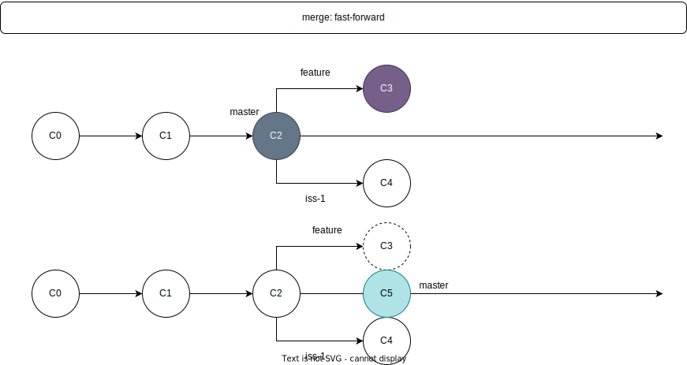
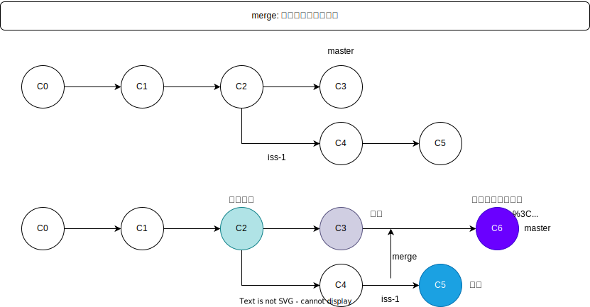

[TOC]

### Git

#### 前言

分布式版本控制 Distributed Version Control System

1. 本地完全克隆代码仓库(本地拥有完整的代码)
2. Git 保存的不是文件的变化或者差异, 而是一系列不同时刻(commit)的 **快照**
3. 几乎所有操作都在本地, 只是最后提交到远程仓库
4. Git保证数据完整性[sha-1散列 基于目录或文件内容]

#### 概念

1.  工作区    【已修改】
2.  暂存区    【已暂存, 保留下次要提交的文件信息】
3.  本地仓库【已提交, 永久存储到git目录】
4.  远程仓库

#### 命令

创建仓库

本地初始化仓库, 通常情况下无需次操作, 仓库基本上都是服务器上

~~~bash
$ mkdir test && cd test 		
$ git init 
$ git clone xxPath.git					# 拉取远程仓库
~~~

工作区状态

1 Untracked  2 new file  3 modified

~~~bash
$ git status  
$ git status -s 						# 精简的输出	
~~~

跟踪文件(添加到暂存区)

注意实际项目中, 并不是所有的修改都需要Track, 按需add, 避免提交错误, 配合上忽略文件

~~~bash
$ git add . 							# 提交全部 
$ git add *.c 
$ git add code.txt  
~~~

暂存区提交到本地仓库

~~~bash
$ git commit -m "version description"
~~~

查看差异

工作目录中当前文件和暂存区域快照之间的差异, 本身只显示尚未暂存的改动

~~~bash
$ git diff 	
$ git diff --staged 					# 暂存区和最后一次提交的差异
~~~

查看提交历史

~~~bash
$ git log [-n]	   	   	 				# 显示n条
$ git log --stat	     				# 显示提交的简略信息
$ git log -p    	     				# 显示提交差异
$ git log -p -2 	     				# 显示提交差异, 两次提交
$ git reflog    	     				# 查看所有的提交记录
$ git log --pretty=format:"%h: %cd %s" --graph
~~~

暂存区回到工作区

~~~bash
$ git reset head  [file]	 			# 回到工作区, 保留修改
~~~

丢弃工作区改动

~~~bash
$ git checkout -- [file] 	  			# 回到工作区,不保留修改,回退到最后一次提交
~~~

本地仓库版本回退道工作区

~~~bash
$ git reset --hard HEAD^
$ git reset --hard HEAD^^
$ git reset --hard HEAD~1
$ git reset --hard HEAD~10
~~~

忽略文件.gitignore

~~~bash
*.a 									# 忽略所有的 .a 文件
!lib.a 									# 但跟踪所有的 lib.a, 即便你在前面忽略了 .a 文件
/TODO   								# 只忽略当前目录下的TODO文件,而不忽略 subdir/TODO
doc/**/*.pdf 							# 忽略 doc/ 目录及其所有子目录下的 .pdf 文件
~~~

远程仓库（默认一个分支master）

~~~bash
$ git fetch origin  					# 推送之前需要fetch, 因为别人可能已经推送过 
$ git pull 								# 拉取对应远程分支, 并且尝试合并
$ git push origin master
~~~

标签

~~~bash
$ git tag -l [--list]
$ git tag -a v1.0.0 -m "tag message"
$ git show v1.0.0
$ git tag -a v0.0.8 [commit-hash] 		# 对过去的提交打标签
$ git push origin v1.0.0			    # 必须显式的推送标签 --tags
$ git tag -d <tagname>				    # 删除标签
$ git push origin --delete <tagname> 	# 删除远程标签
~~~

#### 分支

Git 的分支,其实本质上仅仅是指向提交对象的可变指针(特殊的HEAD 指针, 指向当前分支)

本地分支与远程一一对应

查看分支

~~~bash
$ git branch 					    	# 本地分支
$ git branch -v							# 分支以及最后一次提交
$ git branch -a 						# 远程分支
$ git branch testing					# 创建本地分支
~~~

切换分支

~~~bash
$ git checkout hotfix					# 创建分支【如果有远程, 那么会跟踪远程分支】
$ git checkout -b hotfix				# 创建并且切换分支
~~~

删除分支

~~~bash
$ git branch -d hotfix					# 删除分支
$ $ git push origin --delete serverfix  # 删除远程分支
~~~

合并分支

~~~bash
$ git merge dev 						# 合并分支
~~~

试图合并两个分支时,  如果顺着一个分支走下去能够到达另一个分支, 那么Git 在合并两者的时候,  只会简单的将指针向前推进（指针右移）因为这种情况下的**合并操作没有需要解决的分歧**——这就叫做快进(fast-forward)

但是如果合并iss-1时, 出现分叉, 无法靠移动指针合并, 把两个分支的最新快照C3 和 C5以及二者最近的共同祖先C2进行三方合并, 合并的结果是生成一个新的快照C6, 并提交, 合并过程中可能有冲突出现, 解决冲突, 然后重新提交

远程分支

以 `<remote>/<branch>` 的形式命名, remote 一般是 origin, 通常省略origin

~~~bash
$ git remote show origin
# 基于当前所在分支
$ git fetch orgin
$ git push origin <branch>:<remote-branch>
~~~

变基

改变原始切换分支时的基底, 一般情况下不要进行rebase, 除非你知道自己在做什么

正如前面合并, 当分支可以直接移动指针合并时, 说明没有分叉, 可以快速合并. 但是一旦当分叉, 只能寻找共同祖先, 生成当前最新的快照commit然后合并. 这样的好处是, 可以保存所有的提交与合并信息. 

**如果不想保留某些不必要的分支, 那么可以进行变基操作**

首先找到这两个分支（即当前分支 `iss-1`、变基操作的目标基底分支 `develop`） 的最近共同祖先 `C2`, 然后对比当前分支相对于该祖先的历次提交, 提取相应的修改并存为临时文件,  然后将当前分支指向目标基底 `C3`, 最后以此将之前另存为临时文件的修改依序应用, 通俗来讲就是将C4的变化在C3上, 重播一次得到*C4, 然后合并到develop

~~~bash
$ git checkout iss-1
$ git rebase develop
$ git checkout develop
$ git merge iss-1
~~~

如果rebase过程中有冲突

~~~bash
# 先解决冲突 再保存
$ git add .
$ git rebase --continue
~~~

#### 配置

用户配置

~~~bash
$ git config --global [--local] user.name "God Yao"      		
$ git config --global [--local] user.email "GodYao@example.com"	
$ git config --list
~~~

SSH配置

