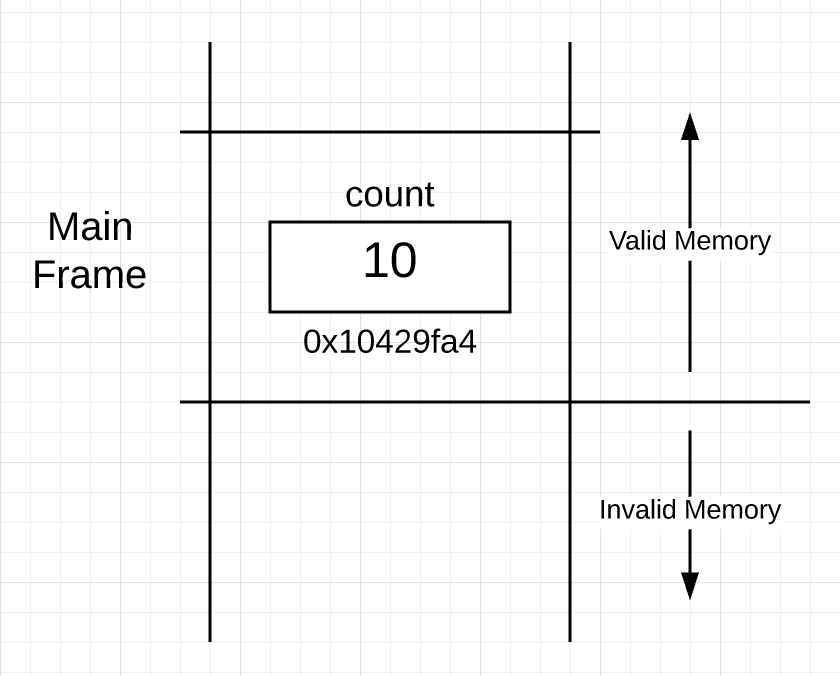
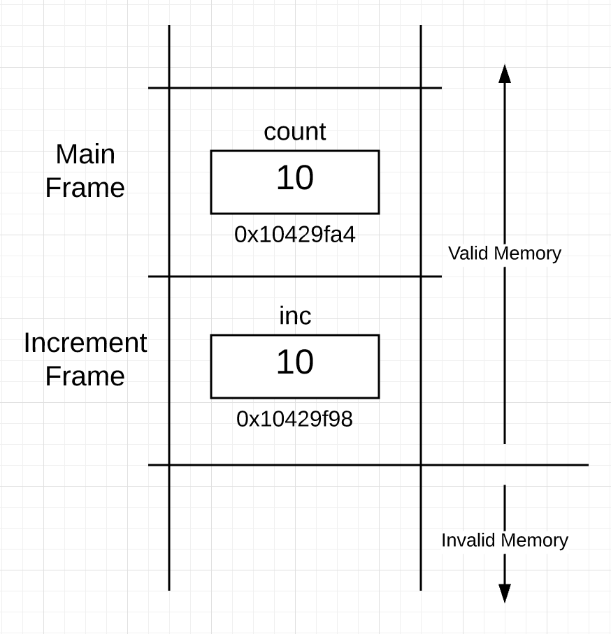
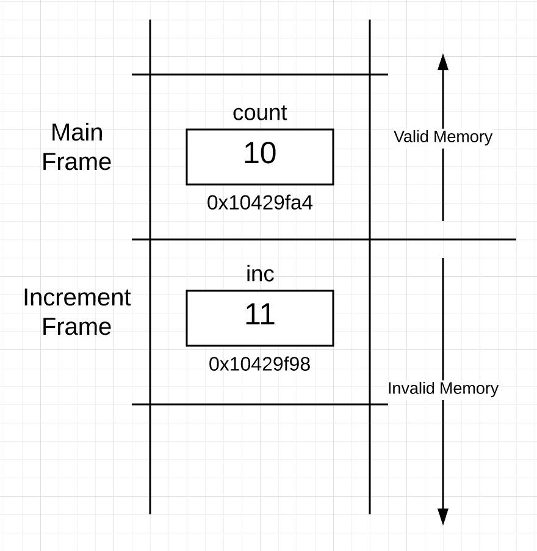
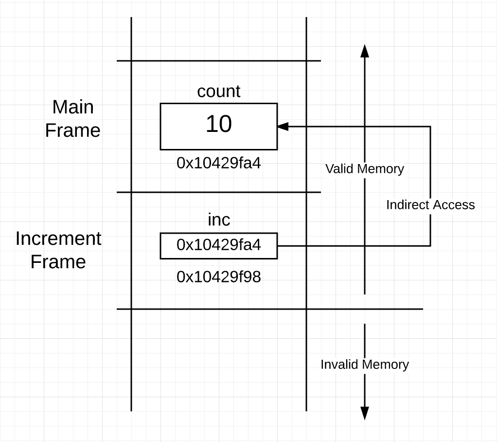
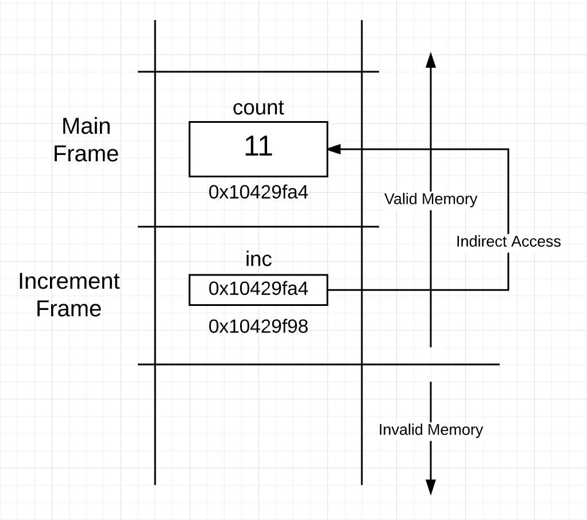

### Language Mechanics On Stacks And Pointers

### Prelude

This is the first post in a four part series that will provide an understanding of the mechanics and design behind pointers, stacks, heaps, escape analysis and value/pointer semantics in Go. This post focuses on stacks and pointers.

Index of the four part series:
\1) [Language Mechanics On Stacks And Pointers](https://www.ardanlabs.com/blog/2017/05/language-mechanics-on-stacks-and-pointers.html)
\2) [Language Mechanics On Escape Analysis](https://www.ardanlabs.com/blog/2017/05/language-mechanics-on-escape-analysis.html)
\3) [Language Mechanics On Memory Profiling](https://www.ardanlabs.com/blog/2017/06/language-mechanics-on-memory-profiling.html)
\4) [Design Philosophy On Data And Semantics](https://www.ardanlabs.com/blog/2017/06/design-philosophy-on-data-and-semantics.html)

### Introduction

I’m not going to sugar coat it, pointers are difficult to comprehend. When used incorrectly, pointers can produce nasty bugs and even performance issues. This is especially true when writing concurrent or multi-threaded software. It’s no wonder so many languages attempt to hide pointers away from programmers. However, if you are writing software in Go, there is no way for you to avoid them. Without a strong understanding of pointers, you will struggle to write clean, simple and efficient code.

### Frame Boundaries

Functions execute within the scope of frame boundaries that provide an individual memory space for each respective function. Each frame allows a function to operate within their own context and also provides flow control. A function has direct access to the memory inside its frame, through the frame pointer, but access to memory outside its frame requires indirect access. For a function to access memory outside of its frame, that memory must be shared with the function. The mechanics and restrictions established by these frame boundaries need to be understood and learned first.

When a function is called, there is a transition that takes place between two frames. The code transitions out of the calling function’s frame and into the called function’s frame. If data is required to make the function call, then that data must be transferred from one frame to the other. The passing of data between two frames is done “by value” in Go.

The benefit of passing data “by value” is readability. The value you see in the function call is what is copied and received on the other side. It’s why I relate “pass by value” with WYSIWYG, because what you see is what you get. All of this allows you to write code that does not hide the cost of the transition between the two functions. This helps to maintain a good mental model of how each function call is going to impact the program when the transition take place.

Look at this small program that performs a function call passing integer data “by value”:

**Listing 1**

```
01 package main
02
03 func main() {
04
05    // Declare variable of type int with a value of 10.
06    count := 10
07
08    // Display the "value of" and "address of" count.
09    println("count:\tValue Of[", count, "]\tAddr Of[", &count, "]")
10
11    // Pass the "value of" the count.
12    increment(count)
13
14    println("count:\tValue Of[", count, "]\tAddr Of[", &count, "]")
15 }
16
17 //go:noinline
18 func increment(inc int) {
19
20    // Increment the "value of" inc.
21    inc++
22    println("inc:\tValue Of[", inc, "]\tAddr Of[", &inc, "]")
23 }
```

When your Go program starts up, the runtime creates the main goroutine to start executing all the initialization code including the code inside the `main` function. A goroutine is a path of execution that is placed on an operating system thread that eventually executes on some core. As of version 1.8, every goroutine is given an initial 2,048 byte block of contiguous memory which forms its stack space. This initial stack size has changed over the years and could change again in the future.

The stack is important because it provides the physical memory space for the frame boundaries that are given to each individual function. By the time the main goroutine is executing the `main` function in Listing 1, the goroutine’s stack (at a very high level) would look like this:

**Figure 1**



You can see in Figure 1, a section of the stack has been “framed” out for the `main` function. This section is called a “stack frame” and it’s this frame that denotes the `main` function’s boundary on the stack. The frame is established as part of the code that is executed when the function is called. You can also see the memory for the `count` variable has been placed at address `0x10429fa4` inside the frame for `main`.

There is another interesting point made clear by Figure 1. All stack memory below the active frame is invalid but memory from the active frame and above is valid. I need to be clear about the boundary between the valid and invalid parts of the stack.

### Addresses

Variables serve the purpose of assigning a name to a specific memory location for better code readability and to help you reason about the data you are working with. If you have a variable then you have a value in memory, and if you have a value in memory then it must have an address. On line 09, the `main` function calls the built-in function `println` to display the “value of” and “address of” the `count` variable.

**Listing 2**

```
09    println("count:\tValue Of[", count, "]\tAddr Of[", &count, "]")
```

The use of the ampersand `&` operator to get the address of a variable’s location is not novel, other languages use this operator as well. The output of line 09 should be similar to the output below if you run the code on a 32bit architecture like the playground:

**Listing 3**

```
count:  Value Of[ 10 ]  Addr Of[ 0x10429fa4 ]
```

### Function Calls

Next on line 12, the `main` function makes a call into the `increment` function.

**Listing 4**

```
12    increment(count)
```

Making a function call means the goroutine needs to frame a new section of memory on the stack. However, things are a bit more complicated. To successfully make this function call, data is expected to be passed across the frame boundary and placed into the new frame during the transition. Specifically an integer value is expected to be copied and passed during the call. You can see this requirement by looking at the declaration of the `increment` function on line 18.

**Listing 5**

```
18 func increment(inc int) {
```

If you look at the function call to `increment` again on line 12, you can see the code is passing the “value of” the `count` variable. This value will be copied, passed and placed into the new frame for the `increment` function. Remember the `increment` function can only directly read and write to memory within its own frame, so it needs the `inc` variable to receive, store and access its own copy of the `count` value being passed.

Just before the code inside the `increment` function starts executing, the goroutine’s stack (at a very high level) would look like this:

**Figure 2**



You can see the stack now has two frames, one for `main` and below that, one for `increment`. Inside the frame for `increment`, you see the `inc` variable and it contains the value of `10` that was copied and passed during the function call. The address of the `inc` variable is `0x10429f98` and is lower in memory because frames are taken down the stack, which is just an implementation detail that doesn’t mean anything. What’s important is that the goroutine took the value of `count` from within the frame for `main` and placed a copy of that value within the frame for `increment` using the `inc` variable.

The rest of the code inside of `increment` increments and displays the “value of” and “address of” the `inc` variable.

**Listing 6**

```
21    inc++
22    println("inc:\tValue Of[", inc, "]\tAddr Of[", &inc, "]")
```

The output of line 22 on the playground should look something like this:

**Listing 7**

```
inc:    Value Of[ 11 ]  Addr Of[ 0x10429f98 ]
```

This is what the stack looks like after the execution of those same lines of code:

**Figure 3**


After lines 21 and 22 are executed, the `increment` function returns and control goes back to the `main` function. Then the `main` function displays the “value of” and “address of” the local `count` variable again on line 14.

**Listing 8**

```
14    println("count:\tValue Of[",count, "]\tAddr Of[", &count, "]")
```

The full output of the program on the playground should look something like this:

**Listing 9**

```
count:  Value Of[ 10 ]  Addr Of[ 0x10429fa4 ]
inc:    Value Of[ 11 ]  Addr Of[ 0x10429f98 ]
count:  Value Of[ 10 ]  Addr Of[ 0x10429fa4 ]
```

The value of `count` in the frame for `main` is the same before and after the call to `increment`.

### Function Returns

What actually happens to the memory on the stack when a function returns and control goes back up to the calling function? The short answer is nothing. This is what the stack looks like after the return of the `increment` function:

**Figure 4**



The stack looks exactly the same as Figure 3 except the frame associated with the `increment` function is now considered to be invalid memory. This is because the frame for `main` is now the active frame. The memory that was framed for the `increment` function is left untouched.

It would be a waste of time to clean up the memory of the returning function’s frame because you don’t know if that memory will ever be needed again. So the memory is left the way it is. It’s during each function call, when the frame is taken, that the stack memory for that frame is wiped clean. This is done through the initialization of any values that are placed in the frame. Because all values are initialized to at least their “zero value”, stacks clean themselves properly on every function call.

### Sharing Values

What if it was important for the `increment` function to operate directly on the `count` variable that exists inside the frame for `main`? This is where pointers come in. Pointers serve one purpose, to share a value with a function so the function can read and write to that value even though the value does not exist directly inside its own frame.

If the word “share” doesn’t come out of your mouth, you don’t need to use a pointer. When learning about pointers, it’s important to think using a clear vocabulary and not operators or syntax. So remember, pointers are for sharing and replace the `&` operator for the word “sharing” as you read code.

### Pointer Types

For every type that is declared, either by you or the language itself, you get for free a complement pointer type you can use for sharing. There already exists a built-in type named `int` so there is a complement pointer type called `*int`. If you declare a type named `User`, you get for free a pointer type called `*User`.

All pointer types have the same two characteristics. First, they start with the character `*`. Second, they all have the same memory size and representation, which is a 4 or 8 bytes that represent an address. On 32bit architectures (like the playground), pointers require 4 bytes of memory and on 64bit architectures (like your machine), they require 8 bytes of memory.

*In the spec, [pointer types](https://golang.org/ref/spec#PointerType) are considered to be [type literals](https://golang.org/ref/spec#Types), which mean they are unnamed types composed from an existing type.*

### Indirect Memory Access

Look at this small program that performs a function call passing an address “by value”. This will share the `count` variable from the `main` stack frame with the `increment` function:

**Listing 10**

```
01 package main
02
03 func main() {
04
05    // Declare variable of type int with a value of 10.
06    count := 10
07
08    // Display the "value of" and "address of" count.
09    println("count:\tValue Of[", count, "]\t\tAddr Of[", &count, "]")
10
11    // Pass the "address of" count.
12    increment(&count)
13
14    println("count:\tValue Of[", count, "]\t\tAddr Of[", &count, "]")
15 }
16
17 //go:noinline
18 func increment(inc *int) {
19
20    // Increment the "value of" count that the "pointer points to". (dereferencing)
21    *inc++
22    println("inc:\tValue Of[", inc, "]\tAddr Of[", &inc, "]\tValue Points To[", *inc, "]")
23 }
```

There are three interesting changes that were made to this program from the original. Here is the first change on line 12:

**Listing 11**

```
12    increment(&count)
```

This time on line 12, the code is not copying and passing the “value of” `count` but instead the “address of” `count`. You can now say, I am “sharing” the `count` variable with the `increment` function. This is what the `&` operator says, “sharing”.

Understand this is still a “pass by value”, the only difference is the value you are passing is an address instead of an integer. Addresses are values too; this is what is being copied and passed across the frame boundary for the function call.

Since the value of an address is being copied and passed, you need a variable inside the frame of `increment` to receive and store this integer based address. This is where the declaration of the integer pointer variable comes in on line 18.

**Listing 12**

```
18 func increment(inc *int) {
```

If you were passing the address of a `User` value, then the variable would have needed to be declared as a `*User`. Even though all pointer variables store address values, they can’t be passed any address, only addresses associated with the pointer type. This is the key, the reason to share a value is because the receiving function needs to perform a read or write to that value. You need the type information of any value in order to read and write to it. The compiler will make sure that only values associated with the correct pointer type are shared with that function.

This is what the stack looks like after the function call to `increment`:

**Figure 5**



You can see in figure 5 what the stack looks like when a “pass by value” is performed using an address as the value. The pointer variable inside the frame for the `increment` function is now pointing to the `count` variable, which is located inside the frame for `main`.

Now using the pointer variable, the function can perform an indirect read modify write operation to the `count` variable located inside the frame for `main`.

**Listing 13**

```
21    *inc++
```

This time the `*` character is acting as an operator and being applied against the pointer variable. Using the `*` as an operator means, “the value that the pointer points to”. The pointer variable allows indirect memory access outside of the function’s frame that is using it. Sometimes this indirect read or write is called dereferencing the pointer. The `increment` function still must have a pointer variable within its frame it can directly read to perform the indirect access.

Now in figure 6 you see what the stack looks like after the execution of line 21.

**Figure 6**



Here is the final output of this program:

**Listing 14**

```
count:  Value Of[ 10 ]   	   	Addr Of[ 0x10429fa4 ]
inc:    Value Of[ 0x10429fa4 ]  	Addr Of[ 0x10429f98 ]   Value Points To[ 11 ]
count:  Value Of[ 11 ]   	   	Addr Of[ 0x10429fa4 ]
```

You can see the “value of” the `inc` pointer variable is the same as the “address of” the `count` variable. This sets up the sharing relationship that allowed the indirect access to the memory outside of the frame to take place. Once the write is performed by the `increment` function through the pointer, the change is seen by the `main` function when control is returned.

### Pointer Variables Are Not Special

Pointer variables are not special because they are variables like any other variable. They have a memory allocation and they hold a value. It just so happens that all pointer variables, regardless of the type of value they can point to, are always the same size and representation. What can be confusing is the `*` character is acting as an operator inside the code and is used to declare the pointer type. If you can distinguish the type declaration from the pointer operation, this can help alleviate some confusion.

### Conclusion

This post has described the purpose behind pointers and how stack and pointer mechanics work in Go. This is the first step in understanding the mechanics, design philosophies and guidelines needed for writing consistent and readable code.

In summary this is what you learned:

- Functions execute within the scope of frame boundaries that provide an individual memory space for each respective function.
- When a function is called, there is a transition that takes place between two frames.
- The benefit of passing data “by value” is readability.
- The stack is important because it provides the physical memory space for the frame boundaries that are given to each individual function.
- All stack memory below the active frame is invalid but memory from the active frame and above is valid.
- Making a function call means the goroutine needs to frame a new section of memory on the stack.
- It’s during each function call, when the frame is taken, that the stack memory for that frame is wiped clean.
- Pointers serve one purpose, to share a value with a function so the function can read and write to that value even though the value does not exist directly inside its own frame.
- For every type that is declared, either by you or the language itself, you get for free a compliment pointer type you can use for sharing.
- The pointer variable allows indirect memory access outside of the function’s frame that is using it.
- Pointer variables are not special because they are variables like any other variable. They have a memory allocation and they hold a value.