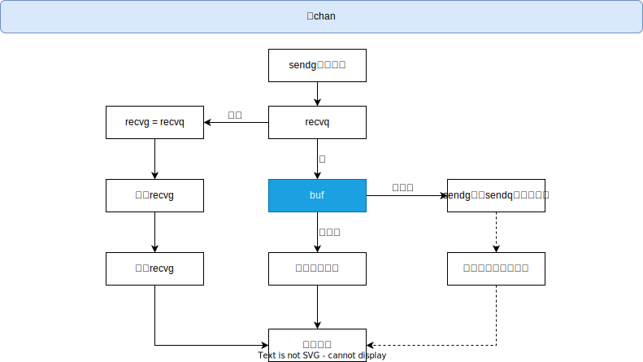
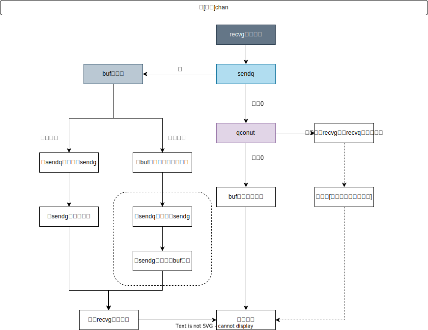

[TOC]

### Channle

#### 底层结构

```go
type hchan struct {
    qcount   uint           // 当前队列中剩余元素个数
    dataqsiz uint           // 环形队列长度，即可以存放的元素个数
    buf      unsafe.Pointer // 环形队列指针
    elemsize uint16         // 每个元素的大小
    closed   uint32         // 标识关闭状态
    elemtype *_type         // 元素类型
    sendx    uint           // 队列下标，指示元素写入时存放到队列中的位置
    recvx    uint           // 队列下标，指示元素从队列的该位置读出
    recvq    waitq          // 等待读消息的goroutine队列
    sendq    waitq          // 等待写消息的goroutine队列
    lock mutex              // 互斥锁，chan不允许并发读写
}
```

#### 环形缓冲队列

chan内部实现了一个环形队列作为其缓冲区，队列的长度是创建chan时指定的


#### g队列

阻塞

1. 读数据：如果缓冲区为空或者没有缓冲区，当前g被阻塞
2. 写数据：如果缓冲区满或者没有缓冲区，当前g被阻塞

唤醒

1. 读阻塞的g会被写g唤醒
2. 写阻塞g会被读g唤醒

一般情况下，recvq和sendq有一个为空，例外：select监听一个g的读写

#### 写流程



#### 读流程



#### Channel Mode

##### Close channle


##### Logic Mode