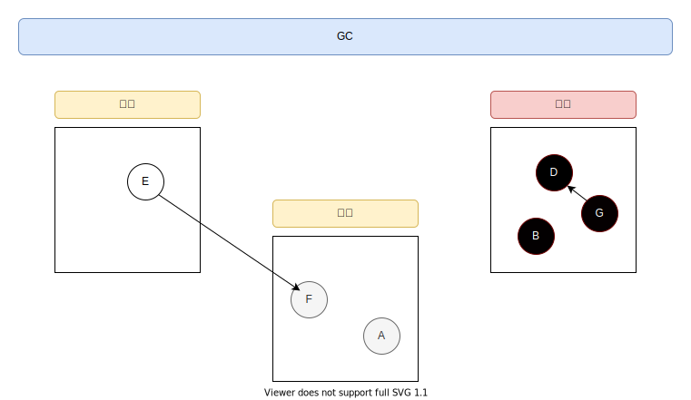

[TOC]

### Chapter2

> 认识Go程序运行的内部机制

#### 本章概览

> 介绍垃圾回收以及其运行机制、与C代码相互调用、panic、defer、recover

1. 编译器
2. 垃圾回收工作原理、以及如何检测垃圾回收情况
3. 在Go中调用C，C中调用Go
4. panic、recover
5. unsafe包
6. defer
7. Linux工具strace、FreeBSD工具dtrace
8. Go环境信息
9. 节点树
10. Go汇编

#### 编译器

> Go编译器需要在go tool的帮助下执行

1. 编译

> 结果是一个包含目标代码的二进制文件，但是不能直接运行，只是目标代码的""直译"

~~~bash
Mastering Go apple$ go tool compile go_tool.go 
Mastering Go apple$ ls
go_tool.go      go_tool.o
~~~

2. 打包

> 可以将多个目标文件打包为一个.a文件 

~~~bash
Mastering Go apple$ go tool compile -pack go_tool.go 
Mastering Go apple$ ls
go_tool.a       go_tool.go      go_tool.o
~~~

3. 检测竞态条件

> 在并发编程，可能涉及资源竞争、锁等问题，需要检测竞态条件

~~~bash
go tool compile -race go_tool.go
~~~

4. 汇编

~~~bash
go tool compile -S go_tool.go
~~~

#### 垃圾回收

> 更多信息查看runtime下mgc.go文件

1. 目标

> 检测哪些对象超出范围并且不会被引用到，然后释放该空间

2. 特点

> 1. 垃圾回收是和程序并行的，和调度器一起工作
> 2. 写屏障
> 3. 非分代和非压缩

~~~
The GC runs concurrently with mutator threads, is type accurate (aka precise), allows multiple GC thread to run in parallel. It is a concurrent mark and sweep that uses a write barrier. It is non-generational and non-compacting. Allocation is done using size segregated per P allocation areas to minimize fragmentation while eliminating locks in the common case.
GC与mutator线程并发运行，它是类型精确，允许多个GC线程并行运行。它是一个使用写屏障的并发标记和扫描。它是非世代的，不可压缩的。分配是使用按P分配的大小隔离的区域来完成的，以最大限度地减少碎片，同时消除常见情况下的锁。
~~~

3. 例子

~~~go
func main() {
	f, err := os.Create("./gcTrace.out")
	if err != nil {
		panic(err)
	}
	defer f.Close()
	err = trace.Start(f)
	if err != nil {
		log.Println(err)
		return
	}
	defer trace.Stop()
	var mem runtime.MemStats
	PrintGcToFile(mem)
	for i := 0; i < 10; i++ {
        // 大量分配内存
		_ = make([]byte, 500000000)
	}
	PrintGcToFile(mem)
}
func PrintGcToFile(mem runtime.MemStats) {
	runtime.ReadMemStats(&mem)
	log.Println("mem Alloc", mem.Alloc)
	log.Println("mem TotalAlloc", mem.TotalAlloc)
	log.Println("mem HeapAlloc", mem.HeapAlloc)
	log.Println("mem NumGc", mem.NumGC)
}
~~~

输出的结果如下

~~~bash
2020/12/15 09:41:43 mem Alloc 125152
2020/12/15 09:41:43 mem TotalAlloc 125152
2020/12/15 09:41:43 mem HeapAlloc 125152
2020/12/15 09:41:43 mem NumGc 0
2020/12/15 09:41:44 mem Alloc 500127272
2020/12/15 09:41:44 mem TotalAlloc 5000206504
2020/12/15 09:41:44 mem HeapAlloc 500127272
2020/12/15 09:41:44 mem NumGc 9
~~~

如果想得到更多的垃圾回收信息，可用如下的开启gctrace

~~~bash
GODEBUG=gctrace=1 go run gc.go
~~~

输出结果如下，每项详细信息可查阅文档

~~~bash
gc 1 
	@0.007s 3%: 0.017+0.65+0.034 ms clock, 0.13+1.1/0.63/0+0.27 ms cpu, 
	4->4->0 MB, 5 MB goal, 8 P
gc 2 
	@0.011s 2%: 0.011+0.29+0.003 ms clock, 0.091+0.16/0.28/0.47+0.029 ms cpu, 
	4->4->0 MB, 5 MB goal, 8 P
gc 3 
	@0.022s 1%: 0.018+0.28+0.003 ms clock, 0.14+0.18/0.28/0.59+0.025 ms cpu, 
	4->4->0 MB, 5 MB goal, 8 P
......
# command-line-arguments
gc 1 
	@0.004s 4%: 0.016+2.7+0.024 ms clock, 0.13+0.35/2.2/3.1+0.19 ms cpu, 
	4->4->3 MB, 5 MB goal, 8 P
gc 2 
	@0.010s 7%: 0.072+1.6+0.016 ms clock, 0.58+1.1/2.4/2.6+0.12 ms cpu, 
	6->6->4 MB, 7 MB goal, 8 P
.....
~~~

##### 三色标记-清除算法

> Go的垃圾回收器基于三色标记清除算法 

> 1. 三色标记清除算法 + 写屏障
> 2. 垃圾回收器与Go的调度器并发执行
> 3. 首要原则：把堆中的对象按照颜色分到不同的集合，颜色根据算法标记

##### 三色集合

1. 黑色集合

    **黑色集合中对象确保没有任何指针指向白色集合中对象**

2. 白色集合

    白色集合中允许有指针指向黑色集合对象, 不会对垃圾回收造成影响；白色集合中对象就是垃圾回收的对象

3. 灰色集合

    灰色集合可能会有指针指向白色集合对象

**注意：没有黑色对象能进入白色集合，这允许算法去操作并清除白色集合对象、并且黑色对象不能直接指向白色集合中的对象**

##### 回收流程

1. 当垃圾回收开始时，全部对象标记为白色

2. 然后垃圾回收器遍历所以根对象，将其标记为灰色

    > 根对象就是程序能直接访问的对象，全局变量以及栈里面

3. 选取一个灰色对象，将其标记为黑色，然后去寻找该对象是否有指针指向白色集合的对象

    > 1. 灰色对象被其他对象所指向，那么灰色对象就会被标记为黑色，并且放入黑色集合
    >
    > 2. 如果灰色对象有一个或多个指针指向白色对象，那么所指向的白色对象将被标记为灰色，并放入灰色集合
    >
    > 3. 只要灰色对象存在，这个过程就会一直存在
    > 4. 在过程中，如果灰色对象变为不可达对象，那么当次GC不会回收该对象，可能下次GC回收

4. 最后灰色集合为空，白色集合就是需要清除的对象

##### 写屏障

在GC过程中，会运行一个修改器程序mutator，该修改器会在适当的时候执行写屏障write barrier

1. 作用

> 保持黑色集合总没有任何对象指针指向白色集合对象，必须保持这个状态，否则GC会出现问题

2. 执行时机

> 每次堆中的指针被修改，意味着该对象是可达的，写屏障都会去执行，将其标记为灰色并且放入灰色集合
>
> mutator保持黑色集合中没有任何对象指向白色集合的对象，是靠写屏障的方法

##### GC 图例



1. E处于白色集合，可以访问灰色集合F对象；E处于白色集合不能被其他任何对象引用
2. A、B、G是根对象，不会被GC
3. 继续处理灰色集合A、F对象，A、F进入黑色集合
    * F处于灰色集合，并且没有指向任何其他对象，所以标记黑色进入黑色集合
    * A是根对象，标记黑色进入黑色集合
4. F在黑色集合中变为不可达，在下一次垃圾回收器的处理循环中被回收

##### 注意点

1. GC 也会作用于channle，注意GC如果发现该channle不可达会直接释放资源
2. runtime.GC() 可以手动GC，但是这个是阻塞调用器的，也就是可能阻塞整个程序

##### 深入GC

**前提**

> Go的垃圾回收器关注点是低延迟。程序运行一般过程是创建对象，用指针操作存活对象，所以在这个过程中，可能创建出不会再被访问到的对象(没有指针指向的对象)，即为垃圾对象，GC就是清理这些对象，释放空间。

**标记-清除算法**

> 垃圾回收使用最简单的就是标记清除算法，算法是遍历和标记(Mark)所有可达对象。但会将程序终止(STW)，然后再去清扫不可达对象(Sweep)

1. 在Mark阶段，对象被标记为白色、灰色、黑色
2. 灰色的可达对象（子对象）被标记为灰色，其本身被标记为黑色
3. 没有更多的灰色对象，就会开始Sweep阶段

**STW问题**

三色标记清除原理简单，但是会有STW存在，会增加延迟

**STW解决**

Go将垃圾处理器作为并发处理过程并且配合三色标记清除算法，来降低延迟

**并发问题**

1. 并发过程可能会移动指针或者创建对象，这会让垃圾处理器处理困难
2. **所以让三色算法并发运行的关键点是：维持标记清除算法的不变要素，即没有黑色对象能指向白色对象**
3. 可以简单理解灰色集合是白色集合与黑色集合之间的屏障

**策略**

1. 新对象必须进入灰色集合，维持不变要素
2. 程序中指针移动，指向的对象必须标记为灰色
3. 每次移动指针，就会自动执行一些代码，也就是写屏障，会重新去标色

**总结**

1. Go采用三色标记-清除算法 + 写屏障机制作为整个GC算法
2. Go的GC处理器是一个实时的垃圾处理器，与其他的g一起并发运行

##### Unsafe Code

> 一种绕过Go类型与内存安全检测的代码，多数情况下与指针有关
>
> 注意：Go的源码程序中并没有unsafe包的整个源码，import的时候是由编译器实现的

例子

1. 任何Go指针都可以转化为unsafe.Pointer指针
2. unsafe.Pointer指针可以覆盖Go的类型系统，这种操作是有风险的

~~~go
func main() {
	var value int64 = 10
	var p1 = &value
	var p2 = (*int32)(unsafe.Pointer(p1))
	*p2 = 11
	log.Println(value)
}
~~~

例子

访问数组，访问无效的元素就会返回一个"随机数字"

```go
func main() {
	arr := [...]int{1, 2, 3, 4, 5}
	pointer := &arr[0]
	log.Println(*pointer)
	addr := uintptr(unsafe.Pointer(pointer)) + unsafe.Sizeof(arr[0])
	for i := 0; i < len(arr) - 1; i++ {
		pointer := (*int)(unsafe.Pointer(addr))
		log.Println(*pointer)
		addr = uintptr(unsafe.Pointer(pointer)) + unsafe.Sizeof(arr[0])
	}
}
```

#### C  Call Go

流程

1. import C
2. export 函数

~~~go
package main

import "C"
import "log"

//export GoFunc
func GoFunc()  {
	log.Println("Go func")
}
func main() {

}
~~~

3. 执行如下编译命令[会有.h与.o文件, .h文件可被c调用]

~~~bash
go build -o callbyC.o -buildmode=c-shared callbyC.go
~~~

#### defer

> 1. defer的作用是注册函数并且是当外围函数返回之后执行的延迟函数
> 2. 多个defer注册函数的情况下，安装LIFO顺序执行

~~~go
func main() {
	for i := 3; i > 0; i-- {
		defer fmt.Print(i)
	}
	for i := 3; i > 0; i-- {
		defer func() {
			fmt.Print(i)
		}()
	}
    // 通常避免其他问题发生，都是使用第三种方式
	for i := 3; i > 0; i-- {
		defer func(i int) {
			fmt.Print(i)
		}(i)
	}
}
~~~

#### Panic与Recover

> 1. panic终止当前流程，并且panicking
> 2. recover收回使用了panic的goroutine的控制权，并且捕获panicking
> 3. recover只能使用在defer中

~~~go
func main() {
	defer func() {
		if err := recover(); err != nil {
			log.Println(err)
		}
	}()
	panic("test panic")
}
~~~