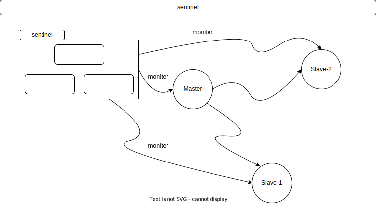

[TOC]

### Cluster

#### Master-Slave

》主从模式, 复制数据到从节点, 读写分离, 降低Master压力; 缺点是可用性不强, 主机宕机的话, 造成写不可用.

从节点启动后, 发送SYNC命令启动同步. 主节点执行BGSAVE命令保存快照(RDB), 传输到从节点. 在传输过程, 以及从节点加载快照过程, 主节点的写命令会存储到缓冲区,  后续发送缓冲区命令. 此后的写命令都会直接同步到从节点

#### Sentinel

》哨兵模式, 健康监控, 故障转移; 选举新的Master

- [x] 监控主节点、从节点是否正常运行
- [ ] 通过API提醒Redis服务器故障
- [ ] 自动故障转移[Automatic Failover]

Ping 超时 主观下线-> 询问其他哨兵, 客观下线->Leader 选举(Raft) 健康、备份完整度、稳定性(启动周期、心跳检测) ->设置为新的主节点 Slave No one ->其他从节点设置为新节点的从节点 Slavaof

#### Cluster

三主三从

采用systemctl管理

~~~bash
$ redis-cli --cluster create 10.211.55.61:6379 10.211.55.62:6379 10.211.55.63:6379 10.211.55.61:6380 10.211.55.62:6380 10.211.55.63:6380 --cluster-replicas 1
~~~

主要的配置修改, 三台机器

master

~~~
dir /var/lib/redis/master
port 6379
bind * -::*
cluster-enabled yes
cluster-config-file nodes-6379.conf
cluster-node-timeout 15000
~~~

slave

~~~
dir /var/lib/redis/slave
port 6380
bind * -::*
cluster-enabled yes
cluster-config-file nodes-6379.conf
cluster-node-timeout 15000
~~~

ACL 访问控制 

注意了, 由于是集群, 所以每个节点都要设置(一般给某个用户设置master读写, slave设置只读)

~~~bash
> acl list
> acl setuser webapp on >webapp2023@xp ~webapp_* +@all
~~~

\> 后面是密码  

~后面是key的前缀 

+@ 后面是分类   +可以直接跟指令

~~~
+<command>：将命令添加到用户可以调用的命令列表中
-<command>: 将命令从用户可以调用的命令列表中移除
+@<category>: 添加一类命令，如@admin
-@<category>: 从客户端可以调用的命令列表中删除命令
+<command>|subcommand: 允许否则禁用特定子命令. 注意这种形式不允许像-DEBUG | SEGFAULT那样，而只能以+开头
+@all: 允许所有命令操作执行. 注意这意味着可以执行将来通过模块系统加载的所有命令
-@all: 不允许所有命令操作执行
~~~

查看支持的分类/指令

~~~
分类
> acl cat
 1) "keyspace"
 2) "read"
 3) "write"
 4) "set"
 5) "sortedset"
 6) "list"
 7) "hash"
 8) "string"
 9) "bitmap"
10) "hyperloglog"
11) "geo"
12) "stream"
13) "pubsub"
14) "admin"
15) "fast"
16) "slow"
17) "blocking"
18) "dangerous"
19) "connection"
20) "transaction"
21) "scripting"

指令
> acl cat keyspace
 1) "ttl"
 2) "unlink"
 3) "persist"
 4) "dump"
 5) "move"
 6) "restore"
 7) "pexpire"
 8) "exists"
 9) "object"
10) "migrate"
11) "pttl"
12) "pexpireat"
13) "readonly"
14) "keys"
15) "renamenx"
16) "readwrite"
17) "wait"
18) "expire"
19) "touch"
20) "flushall"
21) "select"
22) "type"
23) "dbsize"
24) "asking"
25) "expireat"
26) "del"
27) "flushdb"
28) "rename"
29) "scan"
30) "swapdb"
31) "restore-asking"
32) "randomkey"
33) "copy"
~~~

