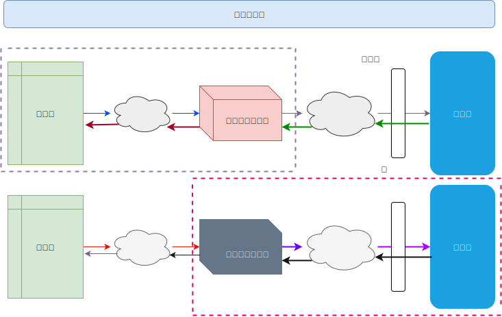
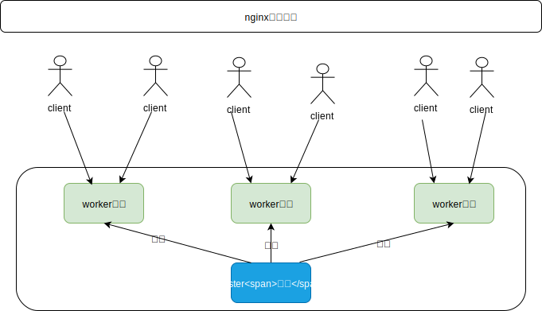

[TOC]

## 基础

> Nginx是一款高性能的 HTTP服务器和反向代理服务器

### 安装

mac

~~~bash
 brew install nginx
~~~

安装成功

~~~bash
Docroot is: /usr/local/var/www

The default port has been set in /usr/local/etc/nginx/nginx.conf to 8080 so that
nginx can run without sudo.

nginx will load all files in /usr/local/etc/nginx/servers/.

To have launchd start nginx now and restart at login:
  brew services start nginx
Or, if you don't want/need a background service you can just run:
  nginx
~~~

服务启动

~~~bash
brew services start nginx
brew services restart nginx
brew services stop nginx
~~~

Linux

安装

~~~bash
sudo apt-get install nginx
~~~

服务器

~~~bash
sudo service nginx start
sudo service nginx restart
sudo service nginx stop
~~~

### 前言

1. 代理服务器

   > 一般是指局域网内部的机器通过代理服务器发送请求到互联网上的服务器,代理服务器一般作用在客户端

2. 正向代理

   作为客户端的代理向服务器发送请求获取响应,客户端是不透明的,服务器端是不知道访问它的是客户端还是代理

3. 反向代理

   作为服务端的代理,接收客户端的请求然后转发到服务器获取到数据后,返回给客户端,服务端是不透明的

   所以客户端是不知道它访问的是客户端还是代理

4. 基本图示如下

由反向代理于防火墙的情况下,可以有效的保护原始的服务器

### 特点

- 跨平台：Nginx 可以在大多数服务器编译运行

- 非阻塞、高并发连接：数据复制时,磁盘I/O的第一阶段是非阻塞的

  > 官方测试能够支撑5万并发连接,实际生产环境中2～3万并发连接数.(Nginx使用epoll模型)

- 事件驱动：通信机制采用epoll模型,支持更多的的并发连接,并发数越大(不超过最大)可以最大化发挥epoll模型

- 内存消耗小

- 稳定性高

==不需要创建线程,每个请求占用的内存也很少,没有上下文切换,事件处理非常的轻量级.==

### 作用

1. 负载均衡,降低负载,提高吞吐量
2. 静态服务器,缓存静态内容
3. 隐藏服务端,保护作用
4. 容灾处理(转发到正常的服务器上)
5. 恢复添加

### 核心模型

> 多进程的工作方式(也支持多线程的模式),主流的方式是多进程的模式,多进程有很多的优点

说明

1. nginx启动后,master进程管理worker进程,监控与重启worker
2. 多个worker之间是平等竞争来自客户端的请求,各个worker之间互相独立
3. worker的数目一般设置为CPU的核心数目

处理请求

1. nginx启动,建立socket的listen,然后从master进程fork出worker进程

2. 每个worker都有自己的socket,每个socket监听的都是同一个IP与端口（但是每个socket是不同的）

3. 请求到来,所有的worker都收到了通知,但是只有一个worker能接受到,其他的失败

   > nginx通过锁的机制,让只有一个worker接受该请求
   >
   > 同一时刻,就只会有一个进程在accpet连接,这样就不会有惊群问题了

4. 读取请求、解析请求、处理请求、返回数据

worker连接池

1. 每个worker都有一个独立的连接池,连接池的大小是worker_connections,但是这里的连接池不是以往我们理解的连接池,而是一个连接的链表结构,简单来说只是表示连接的数目,建立连接取出,用完后再放回去
2. 最大的连接数worker_connections * worker_processes/2 （作为反向代理）因为作为反向代理服务器,每个并发会建立与客户端的连接和与后端服务的连接,会占用两个连接

### 负载均衡算法

1. round-robin

   ==默认的是使用轮询算法==,每个请求按照不同的顺序逐一分配到不同的后端服务器,可以设置轮询的权重weight

   权重越大,服务器被访问的概率就越高

   ~~~nginx
   upstream backend {
       server 127.0.0.1:8000 weight=3;
       server 127.0.0.1:8001;
   }
   ~~~

2. least_conn

   请求会被发送到活跃连接数最少的服务器上

   ~~~nginx
   upstream backend {
       least_conn;
       server 127.0.0.1:8000;
       server 127.0.0.1:8001;
   }
   ~~~

3. ip_hash

   按照访问的ip的哈希结果分配请求,来自同一个ip的用户请求会被分配到固定的后端的服务器

   ~~~nginx
   upstream backend {
       ip_hash;
       server 127.0.0.1:8000;
       server 127.0.0.1:8001;
   }
   ~~~

4. hash

   按照某个键的hansh结果分配

   ~~~nginx
   upstream backend {
       hash $request_uri;      # 请求的hash
       server 127.0.0.1:8000;
       server 127.0.0.1:8001;
   }
   ~~~

