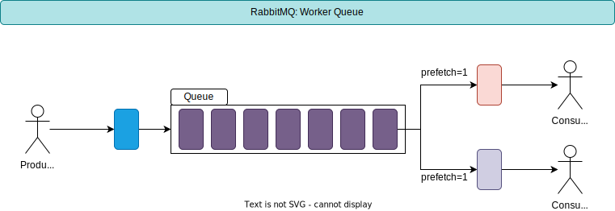

[TOC]

### RabbitMQ Mode

》it accepts, stores, and forwards binary blobs of data ‒ messages

#### Notion

- [ ] Producer: Send Message App

- [ ] Queue: Message Be Stored In Queue [存储]

    -[内存或者大小受限的磁盘] 

    -[本质上是一块大的消息缓冲]

- [ ] Consumer: Receive Message App

#### Simple queue

#### Work queues

》竞争消费模式, 可以有效避免消费堆积

#### Publish/Subscribe

发布订阅模式: 广播模式, 将消息发送给绑定到交换机的所有队列. 

#### Message ACK

- [ ] 自动ACK, 消费者接收到消息,即会删除
- [ ] 手动ACK, 手动控制消费完成后才发送ACK

所以, 为了避免消息丢失的情况, 采用手动ACK较为稳妥.

#### Message Persistent

- [ ] Exchange
- [ ] Queue
- [ ] Message