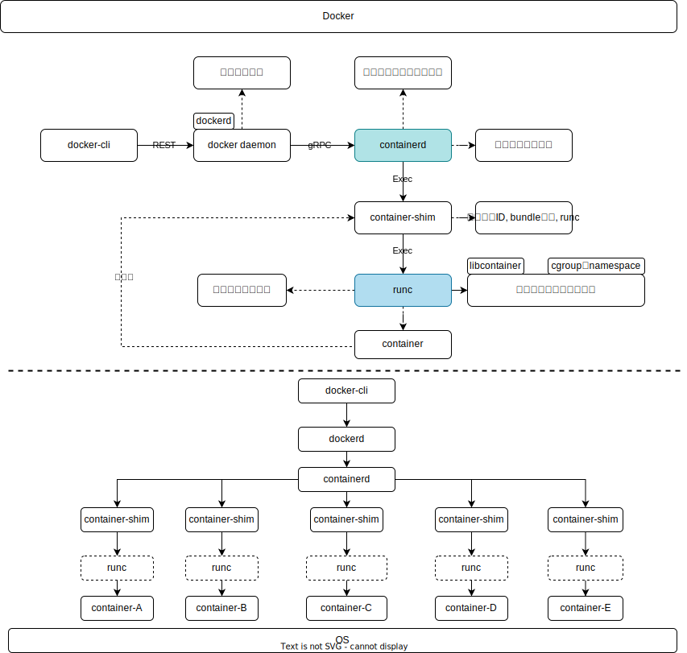
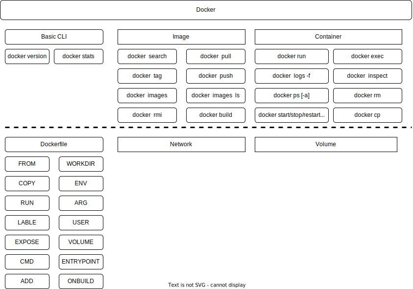

[TOC]

### Docker

#### Container

- [ ] 容器是将软件打包成可运行的标准单元, 便于开发、交付、部署
- [ ] 容器技术的核心功能, 就是通过约束和修改进程的动态表现, 为其创造出一个"边界"
- [ ] 基于Linux内核技术(namespace修改进程的视图, cgroup来约束)

#### Docker

Docker是Go语言开发的容器平台

- [ ] 轻量
- [ ] 一致运行环境
- [ ] 更快启动
- [ ] 环境隔离
- [ ] 构建多平台镜像
- [ ] 共享宿主内核

##### images

- [ ] 容器镜像标准
- [ ] 挂载在容器根目录上、为容器进程提供隔离后执行环境的文件系统, 就是称为"容器镜像"(rootfs)
    - [ ] 整个"操作系统"所包含的文件、配置、目录
    - [ ] Linux系统中的/dev, /proc, /bin, /etc等标准目录和文件, 简单理解rootfs就是操作系统发行版
- [ ]  Union FS技术, 分层存储的模式
    - [ ] 将多个镜像层的文件系统挂载到一个挂载点来实现一个统一文件系统视图
    - [ ] 分层是为了共享, 并且镜像层都是只读的
    - [ ] 制作镜像的"每一步"(写数据)都会生成Layer(层)
    - [ ] docker build Dockerfile的过程就是commit镜像层

~~~bash
$ docker history nginx
~~~

##### container

- [ ] 容器运行时标准
- [ ] 容器是镜像运行的实体, 可创建、删除、启动、停止
- [ ] 在镜像层之上增加读写层

1.  docker create 通过镜像添加可读写层, 创建容器 
2.  docker start 启动容器

docker run 实际上就是包含了 create + start 的步骤

#### Docker Arch

》容器实质是进程

#### Docker Cli

