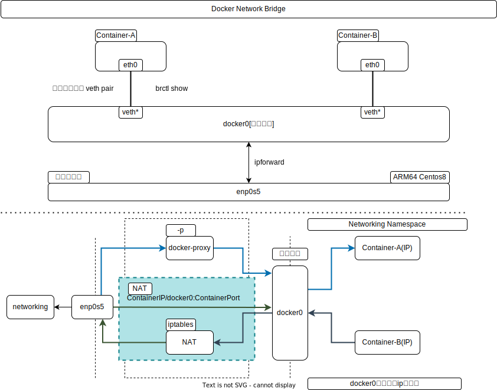

[TOC]

### Docker NetWork

FROM docker docs

~~~bash
$ docker network ls
~~~

#### None

With the network is none a container will not have access to any **external routes**. The container will still have a loopback interface enabled in the container but it does not have any routes to external traffic.

如果 network is none, 容器将无法访问任何**外部路由**. 容器仍将在容器中启用环回接口, 但它没有任何通往外部流量的路由. 

#### Bridge

With the network set to bridge a container will use docker’s default networking setup. A bridge is setup on the host, commonly named **docker0**, and **a pair of veth interfaces** will be created for the container. One side of the veth pair will remain[保留] on the host attached to the bridge while the other side of the pair will be placed inside the container’s namespaces in addition to[除了] the loopback interface. An IP address will be allocated for containers on the bridge’s network and traffic will be routed though this bridge to the container. Containers can communicate via their IP addresses by default. To communicate by name, they must be linked.

网络设置为桥接容器将使用 docker 的默认网络设置.  在主机上设置了一个桥接器, 通常命名为 docker0, 并且将为容器创建一对 veth 接口.  veth 对的一侧将保留在连接到网桥的主机上, 而另一侧将放置在容器的命名空间内, 除了环回接口.  将为桥接网络上的容器分配一个 IP 地址, 并且流量将通过该网桥路由到容器. 

默认情况下, 容器可以通过其 IP 地址进行通信.  要通过名称进行通信, 它们必须被链接--link or --net. 

~~~bash
$ yum install bridge-utils
~~~

#### Host

With the network set to host a container will share the host’s network stack and all interfaces from the host will be available to the container. The container’s hostname will match the hostname on the host system. Note that --mac-address is invalid in host netmode. Even in host network mode a container has its own UTS namespace by default. As such --hostname and --domainname are allowed in host network mode and will only change the hostname and domain name inside the container. Similar to --hostname, the --add-host, --dns, --dns-search, and --dns-option options can be used in host network mode. These options update /etc/hosts or /etc/resolv.conf inside the container. No change are made to /etc/hosts and /etc/resolv.conf on the host.

将网络设置为主机后, 容器将共享主机的网络堆栈, 并且主机的所有接口都可用于容器.  容器的主机名将与主机系统上的主机名匹配.  注意 --mac-address 在主机网络模式下无效.  即使在主机网络模式下, 默认情况下容器也有自己的 UTS 命名空间.  因此 --hostname 和 --domainname 在主机网络模式下是允许的, 并且只会更改容器内的主机名和域名.  与--hostname 类似, --add-host、--dns、--dns-search 和--dns-option 选项可用于主机网络模式.  这些选项更新容器内的 /etc/hosts 或 /etc/resolv.conf.  主机上的 /etc/hosts 和 /etc/resolv.conf 没有更改. 

Compared to the default `bridge` mode, the `host` mode gives *significantly* better networking performance since it uses the host’s native networking stack whereas the bridge has to go through one level of virtualization through the docker daemon. It is recommended to run containers in this mode when their networking performance is critical, for example, a production Load Balancer or a High Performance Web Server.

与默认的桥接模式相比,  主机模式提供了明显更好的网络性能,  因为它使用主机的本机网络堆栈,  而桥接必须通过 docker 守护程序经过一层虚拟化. 当容器的网络性能至关重要时,  建议在此模式下运行容器,  例如生产负载均衡器或高性能 Web 服务器. 

#### Docker-Cli

##### 创建网络	docker network create

~~~bash
$ docker network create [OPTIONS] defx_net
~~~

**常见OPTIONS参数说明**

| option |                 | 说明 |
| :----: | --------------- | :--: |
|   -d   | --driver=bridge |      |
|        |                 |      |

##### 查看网络	docker network ls

~~~bash
$ docker network ls
~~~

