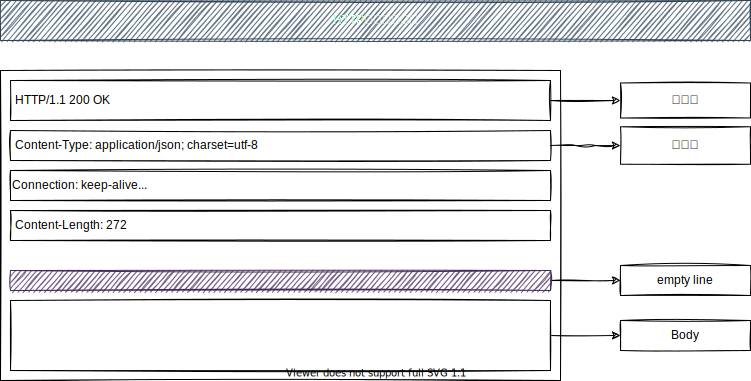

[TOC]

### HTTP

> 超文本传输协议

#### 概述

- [ ] 应用层协议，是稳定"可靠的"，连接由传输层TCP协议控制
- [ ] 超文本传输协议，除了传递文本外，还可以传输图片、音频、视频
- [ ] **客户端(通常是浏览器) —— 服务端模型，一个请求，一个响应**
- [ ] 无状态协议，同一个链接中，两个请求之间是无"关联"，不保存任何数据；通过Cookie可以保持会话；

#### 模型

#### 消息格式

##### 请求消息(request)

- [x] 起始行 (空格分割,  末尾\r\n)
    - [ ] HTTP方法
    - [ ] URL资源
    - [ ] HTTP版本
- [x] 请求头[通用头、请求头、实体头]
    - [x] 不区分大小写
    - [ ] k: v1; v2; (分号分割)
- [ ] 请求体(Body)
    - [x] GET, HEAD一般无Body数据，通常情况下，POST会有Body数据

##### 响应消息(response)

- [x] 状态行
    - [ ] 协议版本
    - [ ] 状态码
    - [ ] 响应短语
- [ ] 响应头[通用头、响应头、实体头]
    - [ ] 不区分大小写
    - [ ] k: v1; v2; (分号分割)
- [ ] Body

#### HTTP1.x协议

##### HTTP1.0

- [ ] 短连接模型，每个HTTP都需要独立的TCP连接

##### HTTP1.1

- [ ] 默认使用长连接，连接复用, 一个TCP连接可以进行多次HTTP请求(注意仍然是一个请求，等待一个响应，按照顺序)

~~~
Connection: keep-alive
~~~

服务端可以通过设置该TCP连接的过期时间(长连接会消耗资源，并且可能受到Dos攻击)

~~~
Keep-Alive: timeout=5, max=1000
~~~

流水线

- [ ] 同一个长连接上，发出连续的请求，而不必等待响应
- [ ] 只有GET、HEAD、PUT、DELETE可以使用，并且现代浏览器并没有默认开启流水线特性

#### Header

##### 通用头

> 适用于请求和响应消息

###### Cache-Control

请求

~~~
Cache-Control: max-age=<seconds>        # 缓存存储周期，相对于请求的时间
Cache-Control: max-stale[=<seconds>]    # 表明客户端愿意接受过期资源
Cache-Control: min-fresh=<seconds>
Cache-control: no-cache		   			# 需要先进行协商缓存验证
Cache-control: no-store		   			# 不使用缓存
Cache-control: no-transform
Cache-control: only-if-cached
~~~

响应

~~~
Cache-control: must-revalidate
Cache-control: no-cache
Cache-control: no-store
Cache-control: no-transform
Cache-control: public					# 表示被任何对象缓存，客户端、代理服务器
Cache-control: private					# 单个用户缓存，不能(作为贡献缓存)被代理服务器缓存
Cache-control: proxy-revalidate
Cache-Control: max-age=<seconds>
Cache-control: s-maxage=<seconds>		# 覆盖max-age 或者 Expired 仅仅适用代理服务缓存
~~~

