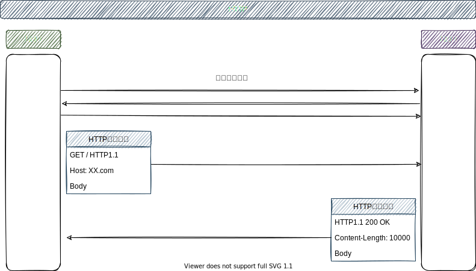

[TOC]

### HTTP

> 超文本传输协议, 内容来源MDN 与 HTTP权威指南

#### 概述

- [ ] 应用层协议，是稳定"可靠的"，连接由传输层TCP协议控制
- [ ] 超文本传输协议，除了传递文本外，还可以传输图片、音频、视频
- [x] **客户端(通常是浏览器) —— 服务端模型，一个请求，一个响应**
- [x] 无状态协议，同一个链接中，两个请求之间是无"关联"，不保存任何数据；通过Cookie可以保持会话；

#### 模型

#### 消息格式

##### 请求消息(request)

- [x] 起始行 (空格分割,  末尾\r\n)
    - [ ] HTTP方法
    - [ ] URL资源
    - [ ] HTTP版本
- [x] 请求头[通用头、请求头、实体头]
    - [x] 不区分大小写
    - [ ] k: v1; v2; (分号分割)
- [ ] 请求体(Body)
    - [x] GET, HEAD一般无Body数据，通常情况下，POST会有Body数据

##### 响应消息(response)

- [x] 状态行
    - [ ] 协议版本
    - [ ] 状态码
    - [ ] 响应短语
- [ ] 响应头[通用头、响应头、实体头]
    - [ ] 不区分大小写
    - [ ] k: v1; v2; (分号分割)
- [ ] Body

#### HTTP1.x协议

##### HTTP1.0

- [x] 短连接模型，每个HTTP都需要独立的TCP连接

##### HTTP1.1

- [x] 默认使用长连接，连接复用, 一个TCP连接可以进行多次HTTP请求(注意仍然是一个请求，等待一个响应，按照顺序)

~~~
Connection: keep-alive
~~~

服务端可以通过设置该TCP连接的过期时间(长连接会消耗资源，并且可能受到Dos攻击)

~~~
Keep-Alive: timeout=5, max=1000
~~~

流水线

- [x] 同一个长连接上，发出连续的请求，而不必等待响应
- [x] 只有GET、HEAD、PUT、DELETE可以使用，**并且现代浏览器并没有默认开启流水线特性**

#### Header

##### 通用首部

> 适用于请求和响应消息

###### Cache-Control

> 用于在http请求和响应中，通过指定指令来实现缓存机制; 缓存指令是单向的，客户端、服务端单独设置

请求

~~~
Cache-Control: max-age=<seconds>        # 缓存存储周期，相对于请求的时间
Cache-Control: max-stale[=<seconds>]    # 表明客户端愿意接受过期资源
Cache-Control: min-fresh=<seconds>
Cache-control: no-cache		   			# 需要先进行协商缓存验证
Cache-control: no-store		   			# 不使用缓存
Cache-control: no-transform
Cache-control: only-if-cached
~~~

响应

~~~
Cache-control: must-revalidate
Cache-control: no-cache
Cache-control: no-store
Cache-control: no-transform
Cache-control: public					# 表示被任何对象缓存，客户端、代理服务器
Cache-control: private					# 单个用户缓存，不能(作为贡献缓存)被代理服务器缓存
Cache-control: proxy-revalidate
Cache-Control: max-age=<seconds>
Cache-control: s-maxage=<seconds>		# 覆盖max-age 或者 Expired 仅仅适用代理服务缓存
~~~

###### Connection

> 决定当前事务完成以后，是否关闭网络连接；浏览器兼容性高

~~~
Connection: keep-alive	# HTTP/1.1 默认使用持久连接(和第一个实体代理连接，并且被代理移除)
Connection: close	    # HTTP/1.0 默认使用短连接
~~~

###### Date

> 报文创建的日期和时间

~~~
Date: <day-name>, <day> <month> <year> <hour>:<minute>:<second> GMT
Date: Mon, 06 Sep 2021 02:31:29 GMT
~~~

##### 请求首部

###### Accept

> 通知服务器，客户端可以接受哪些媒体类型【内容协商】

~~~
Accept: */*
Accept: text/*
Accept: image/*
Accept: text/html,application/xhtml+xml,application/xml;q=0.9,*/*;q=0.8[q代表优先级]
~~~

###### Accept-Charset

> 通知服务器，客户端可以接受哪些字符集或者哪些是有限选择字符集【内容协商】

~~~
Accept-Charset: charset | "*" [";" "q" "=" qvalue]
Accept-Charset: *
~~~

###### Accept-Encoding

> 通知服务器，客户端可以接受的编码方式

~~~
Accept-Encoding: content-coding | "*" [";" "q" "=" qvalue]
Accept-Encoding: *
Accept-Encoding: gzip, deflate, br
~~~

###### Accept-Language

> 通知服务器，客户端可接受或者优选哪些语言【内容协商】

~~~
Accept-Language: language-range [";" "q" "=" qvalue]
Accept-Language: en
Accept-Language: en;q=0.7, en-gb;q=0.5
~~~

###### Authorization

> 客户端发送，回应服务端的身份认证信息
>
> 客户端收到401响应后，要求在请求中包含这个首部

~~~
Authorization: Jwt
~~~

##### 响应首部

###### Accept-Ranges

> 告知客户端是否接受请求资源的某个范围

~~~
Accept-Ranges: range-unit | none
Accept-Ranges: none
Accept-Ranges: bytes
~~~

###### Age

> 告知客户端响应已经产生多长时间
>
> HTTP/1.1 缓存必须在发送的每条响应中都包含一个 `Age` 首部

~~~
Age: delta-seconds
Age: 60
~~~

###### Allow

> 通知客户端可以对特定资源使用哪些HTTP方法
>
> 发送 405 Method Not Allowed 响应的 HTTP/1.1 服务器必须包含 `Allow` 首部

~~~
Allow: #Method
Allow: GET, HEAD
~~~

##### 实体首部

###### Content-Encoding

> 说明是否对某对象进行过编码，可以告诉客户端，服务端对对象进行过那种类型的编码

~~~
Content-Encoding: gzip
Content-Encoding: compress, gzip
~~~

###### Content-Language

> 告诉客户端，应该理解哪种自然语言

~~~
Content-Language: en, fr
~~~

###### Content-Length

> 说明实体主体的长度

~~~
Content-Length: 1*DIGIT
Content-Length: 1024
~~~

###### Content-MD5

> 服务器用来对报文主体进行完整性检查(只有原始服务器或者客户端才可以在报文中插入该首部)
>
> 通过这个首部可以端到端的检查数据，检查在传输过程中是否对数据进行了修改(不可靠)

~~~
Content-MD5: md5-digest
Content-MD5: Q2h1Y2sgSW51ZwDIAXR5IQ==  # Base-64 或者128位MD5
~~~

###### Content-Range

> 请求传输某范围的文档，产生的结果由该首部给出，提供了请求实体所在原始实体的(范围), 并且给出了整个实体的长度
>
> 以 206 Partial Content 响应码进行响应的服务器，不能包含将“`*`”作为长度使用的 `Content-Range` 首部

~~~
Content-Range: bytes 500-999 / 5400
~~~

###### Content-Type

> 说明报文中对象的媒体类型

~~~
Content-Type: text/html
Content-Type: application/json
~~~

