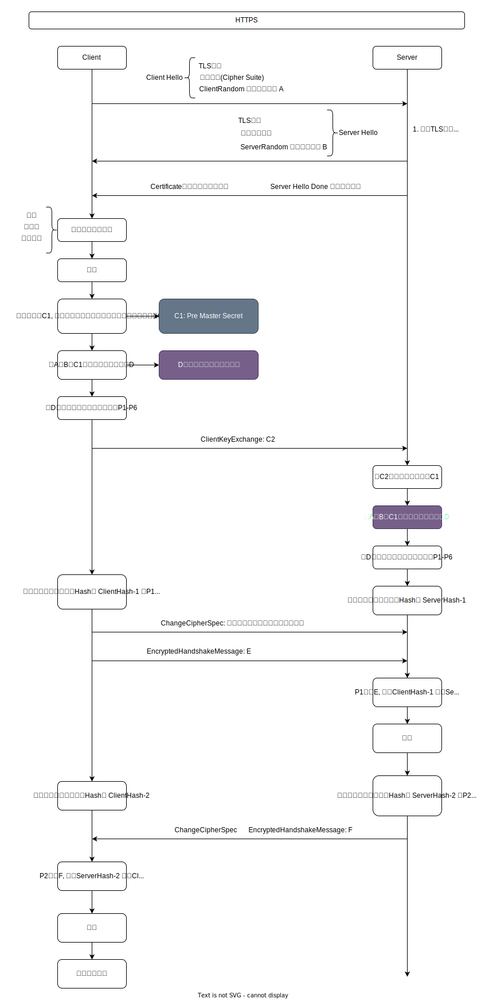

[TOC]

### HTTPS

#### HTTPS

》超文本安全传输协议

通过TCP建立连接、HTTP进行通信, 利用SSL/TLS进行加密

#### TLS/SSL

》传输层安全协议/安全套接字层 是一种数据传输安全协议

SSL包含记录层和传输层, 记录层协议确定传输层的数据封装格式. 传输层安全协议采用x.509认证, 之后采用非对称加密来做身份认证, 进而交换对称密钥作为数据加解密. 

TLS/SSL是协议标准, x.509是协议实现

#### 加密方式

##### 对称加密

- [ ] 加密、解密使用同一套密钥
- [ ] 运算速度快, 方式简单 
- [ ] 缺点: 密钥采用的是明文传输, 密钥容易被劫获
- [ ] AES、DES、3DES等

##### 非对称加密

- [ ] 加密、解密使用不同的密钥
- [ ] 公钥加密的数据只能通过私钥来解密,私钥加密的数据只能通过公钥解密
- [ ] 更加的安全, 但是加密的效率低
- [ ] RSA等

HTTPS采用混合加密形式

- [ ] 握手阶段: 采用非对称加密传输对称加密使用的密钥, 保障密钥的安全
- [ ] 数据传输阶段: 采用对称加密形式进行通信, 保障效率

#### HTTPS通信流程

1.  TCP的三次握手建立链接
2.  客户端通过发送Client Hello报文开始SSL通信, 报文中包含
    * 客户端支持的SSL的版本
    * 加密组件列表(对称加密算法、非对称加密、Hash)
    * 随机数 ClientRandom
3.  服务器可进行SSL通信时, 会以Server Hello报文作为应答, 和客户端一样, 在报文中包含
    * SSL版本以及加密组件, 服务器的加密组件内容是从接收到的客户端加密组件内筛选出来的
    * 随机数 ServerRandom
4.  之后服务器发送Certificate报文, 报文中包含公开密钥证书
5.  最后服务器发送Server Hello Done 报文通知客户端, 最初阶段的SSL握手协商部分结束
6.  客户端验证数字证书有效性(有效期、域名、颁发机构)
7.  SSL第一次握手结束之后, 客户端以Client Key Exchange报文作为回应, 报文中包含通信加密中使用的一种被称为Pre-master secret的随机密码串, 该报文已用步骤4中的公开密钥进行加密
8.  接着客户端继续发送Change Cipher Spec报文, 该报文会提示服务器, 在此报文之后的通信会采用Pre-master secret密钥加密
9.  客户端发送Finished报文, 该报文包含连接至今全部报文的整体校验值, 这次握手协商是否能够成功, 要以服务器是否能够正确解密该报文作为判定标准
10.  服务器同样发送Change Cipher Spec报文
11.  服务器同样发送Finshed报文
12.  服务器和客户端的Finished报文交换完毕之后, SSL连接就算建立完成, 当然, 通信会受到SSL的保护, 从此处开始进行应用层协议的通信, 即发送HTTP请求

数字证书

客户端不知道自己收到的公钥是不是服务端的, 数字证书用来解决这个问题

1.  首先选择一个可靠的证书认证中心CA
2.  服务器将 [服务器个人信息 + 服务器公钥] 进行Hash形成**信息摘要**
3.  服务器使用CA提供的私钥将上述信息摘要加密形成数字签名 【服务器申请的私钥和公钥】
4.  将[服务器个人信息 + 服务器公钥] 和 数字签名合并形成**数字证书**
5.  客户端拿到数字证书使用 CA提供的公钥对数字签名进行解密得到Hash值 H1【客户端内置很多公钥】
6.  然后将数字证书中的[服务器个人信息 + 服务器公钥] Hash H2,  对比H1和H2, 一致则是服务器发送的