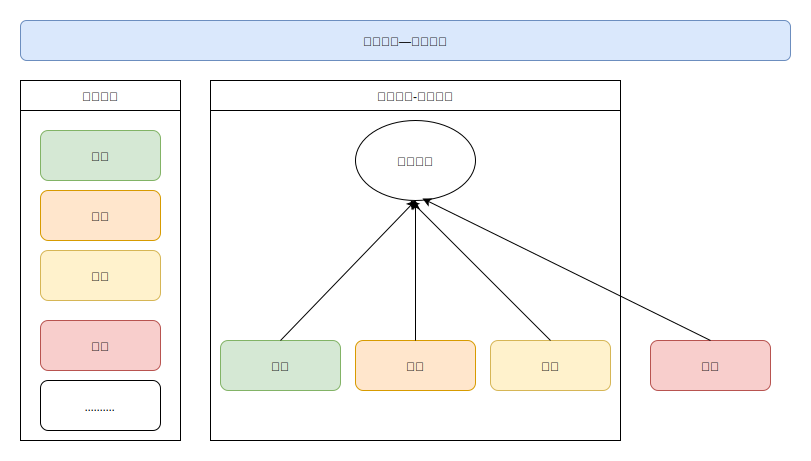
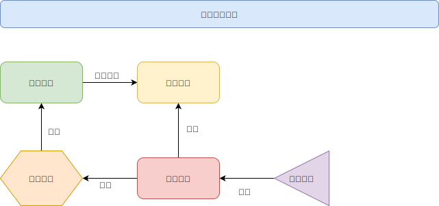

[TOC]

### 问题5: Golang的面向对象思想和原则？【interface机制】

#### interface

1.  方法声明的集合
2.  任何类型实现了interface中的方法，那么就说类型实现了该接口
3.  作为一种数据类型，实现了该接口的类型的对象都可以赋值给对应接口的变量
4.  多态：
    *   接口抽象方法
    *   类型实现接口中的方法
    *   接口类型可以指向类型对象【接口调用类型实现的方法】
5.  interface一定要和多态的思想结合
    *   针对interface写业务
    *   多态具有架构意义，并且良好的接口设计下，可以调用**未来的方法**

#### 开闭原则

##### 平铺式模块设计

~~~go
type Banker struct {}
func (b *Banker) Save()  {
	fmt.Println("save")
}
func (b *Banker) Transfer()  {
	fmt.Println("transfer")
}
func (b *Banker) Pay()  {
	fmt.Println("pay")
}
// 如果需要添加功能，那么需要早这个类型上添加，相当于修改了原来的类型
func main() {
	banker := &Banker{}
	banker.Save()
	banker.Transfer()
	banker.Pay()
}
~~~

##### 开闭设计

~~~go
// 抽象的业务方法
type AbcBanker interface {
	DoWork()
}
// 单一职责
type SaveBanker struct {}
func (sb *SaveBanker) DoWork()  {
	fmt.Println("save")
}
// 单一职责
type TransferBanker struct {}
func (tf *TransferBanker) DoWork()  {
	fmt.Println("transfer")
}
// 单一职责
type PayBanker struct {}
func (sb *PayBanker) DoWork()  {
	fmt.Println("pay")
}
func CallDoWork(banker AbcBanker)  {
	banker.DoWork()
}
// 如果需要添加新的功能，没有修改原系统的代码，不会影响原来的业务系统，额外的模块设计
func main() {
	CallDoWork(new(SaveBanker))
	CallDoWork(new(TransferBanker))
	CallDoWork(new(PayBanker))
}
~~~

#### 依赖倒置原则

1.  先设计接口interface抽象层，不要轻易修改
2.  实现层，实现类型和方法，将接口全部实现
3.  业务层逻辑层，面向抽象层编写

~~~go
// 抽象层
type ICar interface {
	Run()
}
// 实现层
type Car struct {
	Type string
}
func (car *Car) Run() {
	fmt.Printf("%s : running\n", car.Type)
}
// 抽象层
type IDriver interface {
	DriverCar(car ICar)
}
// 实现层
type Driver struct {
	Name string
}
func (d *Driver) DriverCar(car ICar)  {
	fmt.Printf("%s : drvering\n", d.Name)
	car.Run()
}
// 业务层
func main() {
	jack := Driver{Name: "jack"}
	bmw := &Car{Type:"BMW"}
	jack.DriverCar(bmw)
	ft := &Car{Type:"ft"}
	jack.DriverCar(ft)
	mike := Driver{Name: "mike"}
	benz := &Car{Type:"benz"}
	mike.DriverCar(benz)
}
~~~

#### 关系概念

#### 接口意义

1.  多态的思想，调用未来
2.  抽象的思想，低耦合高内聚

