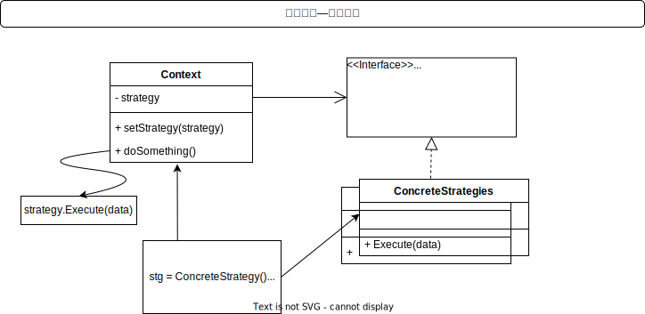

### 策略模式

策略模式是一种行为设计模式, 定义一系列算法(绑定在对象上), 在运行时可通过替换对象来使用不同算法

Context通过成员变量(strategy)引用策略, 并且不直接执行任务，而是将任务委派给实现策略的对象(ConcretaStrategies)。同时通过通用接口(doSomething)来调用策略方法.

这样就可以在不修改Context代码的情况下, 使用不同的算法。

#### Go语言表达

依赖接口而不是依赖实现

Interface

~~~go
// evictionAlgo 策略接口，声明上下文执行策略的方法
type evictionAlgo interface {
	Evict(c *Cache)
}
~~~

Context

~~~go
// Cache ==> Context 上下文
type Cache struct {
	storage      map[string]string
	evictionAlgo evictionAlgo
	capacity     int
	maxCapacity  int
}

// 初始化上下文
func InitCache(e evictionAlgo) *Cache {
	storage := make(map[string]string)
	return &Cache{
		storage:      storage,
		evictionAlgo: e,
		capacity:     0,
		maxCapacity:  2,
	}
}

// SetEvictionAlgo 通过接口与对象交互
func (c *Cache) SetEvictionAlgo(e evictionAlgo) {
	c.evictionAlgo = e
}

func (c *Cache) Add(key, value string) {
	if c.capacity == c.maxCapacity {
		c.Evict()
	}
	c.capacity++
	c.storage[key] = value
}

func (c *Cache) Get(key string) {
	delete(c.storage, key)
}

// doSomething 实际上调用具体的算法策略
func (c *Cache) Evict() {
	c.evictionAlgo.Evict(c)
	c.capacity--
}
~~~

ConcreteStrategies

~~~go
// Fifo 具体策略
type Fifo struct {
}

// Evict 策略实现
func (l *Fifo) Evict(c *Cache) {
	fmt.Println("Evicting by fifo strtegy")
}

type Lru struct {
}

func (l *Lru) Evict(c *Cache) {
	fmt.Println("Evicting by lru strtegy")
}

type Lfu struct {
}

func (l *Lfu) Evict(c *Cache) {
	fmt.Println("Evicting by lfu strtegy")
}
~~~

Client

~~~go
// Client 客户端调用
lfu := &algs.Lfu{}
cache := algs.InitCache(lfu)

cache.Add("a", "1")
cache.Add("b", "2")
cache.Add("c", "3")

lru := &algs.Lru{}
// 替换算法
cache.SetEvictionAlgo(lru)

cache.Add("d", "4")

fifo := &algs.Fifo{}
cache.SetEvictionAlgo(fifo)
cache.Add("e", "5")
~~~

总结

1. 当想使用对象中各种不同的算法变体是，并且希望在运行时切换算法，那么可使用策略模式

    策略模式让你能够将对象关联至可以不同方式执行特定子任务的不同子对象,从而以间接方式在运行时更改对象行为

2. 当有许多仅在执行某些行为时略有不同的相似，可以使用策略模式

    策略模式让你能将不同行为抽取到一个独立类层次结构中， 并将原始类组合成同一个， 从而减少重复代码

3. 如果算法在上下文的逻辑不是特别重要，策略模式可将上下文与算法细节分割

    策略模式让你能将各种算法的代码、 内部数据和依赖关系与其他代码隔离开来。 不同客户端可通过一个简单接口执行算法， 并能在运行时进行切换

4. 当类中使用了复杂条件运算符以在同一算法的不同变体中切换时， 可使用该模式

    策略模式将所有继承自同样接口的算法抽取到独立类中， 因此不再需要条件语句。 原始对象并不实现所有算法的变体， 而是将执行工作委派给其中的一个独立算法对象