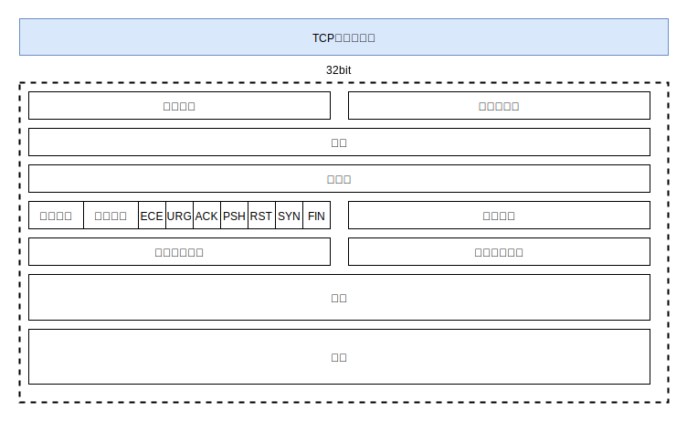

[TOC]

# 计算机网络基础

协议是水平的, 服务是垂直的

## 网络层次划分

### OSI七层

1.  物理层
2.  数据链路层
3.  网络层
4.  传输层
5.  会话层
6.  表示层
7.  应用层

### TCP/IP四层

1.  网络接口层
2.  网际层
3.  运输层
4.  应用层

### TCP/IP五层

1.  物理层：
2.  数据链路层：以太网协议
3.  网络层：IP、ARP、RARP
4.  运输层：TCP、UDP
5.  应用层：FTP、HTTP、DNS、SMTP

### 层作用

1.  物理层
    *   屏蔽物理特性, 为上层传输提供物理媒介
    *   设备：中继器、集线器
2.  数据链路层
    *   数据成帧, 提供可靠的数据传输
    *   以太网协议
    *   设备：网桥、交换机
3.  网络层
    *   路径选择、路由和逻辑寻址, 最后传输到目标节点
    *   IP协议、ARP协议、RARP协议
    *   设备：路由器
4.  传输层
    *   提供端到端的可靠传输、流量控制、差错控制, 最后传输到端口
    *   TCP、UDP协议
    *   设备：网关

## IP地址

### 作用

1.  32位二进制数值, 用于TCP/IP协议中, 标记网络中的一台主机

~~~
00000000.00000000.00000000.00000000 ~ 11111111.11111111.11111111.11111111
~~~

2.  通常使用点分十进制表示

~~~
0.0.0.0 ~ 255.255.255.255
~~~

3.  组成

~~~
网络号【包括子网号】 + 主机号
~~~

### 分类

#### 分类

| 分类 |            范围             |     默认掩码     |             说明              |
| :--: | :-------------------------: | :--------------: | :---------------------------: |
| A类  |  0.0.0.0 ~ 126.255.255.255  |   255.0.0.0/8    |     第一个字节作为网络号      |
| B类  | 128.0.0.0 ~ 191.255.255.255 |  255.255.0.0/16  |     前两个字节作为网络号      |
| C类  | 192.0.0.0 ~ 223.255.255.255 | 255.255.255.0/16 |     前三个字节作为网络号      |
| D类  | 224.0.0.0 ~ 239.255.255.255 |                  | 作为组播地址（一对多的通信）  |
| E类  | 240.0.0.0 ~ 255.255.255.255 |                  | E类地址为保留地址, 供以后使用 |

#### 说明

1.  IP地址由网络号 + 主机号组成
2.  **网络地址**：主机号全是0的地址, 处于那个网络
3.  **广播地址**：主机号全是1的地址
4.  255.255.255.255
    *   受限的广播地址
    *   只能用于本地网络, 路由器不会转发这类地址
5.  127.0.0.1 本地回环地址, 一般表示本机地址
6.  ABC私有地址, 不会在全球使用, 只具有本地意义
    *   A  10.0.0.0 ～ 10.255.255.255.255
    *   B   172.16.0.0 ~ 172.31.255.255
    *   192.168.0.0 ~ 192.168.255.255
7.  网关：一个IP网络通向另一个IP网络【也是一个IP地址】

### 子网掩码

#### 作用

*   标示两个IP地址是否属于一个子网
*   IP地址和 子网掩码做 与运算 得到网络号

#### 计算子网掩码

1.  子网划分个数 N
2.  将 N 化为二进制, 得出二进制位数 K
3.  取得该类IP地址的子网掩码, 将其主机地址部分的的前K位置1
    *   255.255.0.0  ——> 主机位置K位置5  【假设B类IP地址】
    *   255.255.248.0

## ARP/RARP

**作用**

1.  地址解析协议
2.  ARP缓冲区建立 IP 和 MAC地址对应表
3.  主机发送信息时将包含目标IP地址的ARP请求广播到网络上的所有主机, 并单播接收返回消息, 以此确定目标的MAC物理地址
4.  RARP的目的相反, 通过MAC地址得出IP地址

## 路由选择协议

1.  RIP贝尔曼福特算法

    选择路由的标准是跳数, 大于15则会丢弃数据包

2.  OSPF开放式最短路径优先

    选择路由的度量标准是带宽, 延迟

## TCP/IP协议

### TCP概述

**TCP（Transmission Control Protocol）传输控制协议**

1.  有连接
2.  可靠的
3.  面向字节流
4.  全双工通信，TCP两端既可以作为发送端也可以作为接收端
5.  连接的两端只能是两个端点，即一对一，不能一对多
6.  首部至少20个字节，比UDP大的多

**什么是TCP连接**

TCP连接是一种抽象的概念，表示一条可以通信的链路
每个TCP连接有且仅有两个端点，表示通信的双方，且双方在任意时刻都可以作为发送者和接受者

**TCP报文格式**

1.  TCP首部一般是20字节
2.  16位源端口和目的端口号
3.  32bit序号和32位确认号
4.  16位接收窗口，用于流量控制
5.  4bit首部长度，TCP选项字段原因TCP首部是可变的，通常为空，典型长度是20字节
6.  选项，协商MSS，最大报文长度
7.  6bit标志字段
    *   ACK：指示确认字段有效
    *   RST、SYN、FIN：连接建立和拆除
    *   PSH：接收方将数据交给上层
    *   URG：紧急数据存在

### 可靠传输?

#### 问题？

1.  差错校验？比特差错问题
2.  接收方反馈
3.  数据报丢失，重传

#### 解决方案[差错恢复]

##### ARQ协议

###### 校验和

TCP/UDP首部字段，因特网校验和用来确定差错校验

###### 确认反馈

ACK确认机制，每发送一个分组就需要确认，或者采取累积确认方式

###### 序号机制

每个分组或者报文段都有序号，用来检测丢失分组和冗余分组

###### 超时重发

每发送一个分组就启动一个定时器，超时就会重传，序号用来处理冗余分组

##### 流水线协议

不以停等的方式确认，允许发送多个分组而无需等待，只要后面发送方累积确认，收到一个ACK

###### 回退N步[滑动窗口协议]

必须是有序的分组/报文段

1.  滑动窗口
    *   窗口长度N
    *   Base基序号
    *   Nextseqnum 最小未使用序号，下一个待发分组
2.  窗口分组状态
    *   已经确认
    *   发送，未确认
    *   可用，未发送
    *   不可用
3.  发送方流程
    *   检测窗口是否已经满，未满，产生分组发送，已满等待
    *   GBN协议，采用累积确认收到一个ACK，表示接收方已经正确接收到n序号以及n以前的所有分组
    *   超时发送未被确认的分组
4.  接收方
    *   正确收到，就交给上层
    *   如果遇到丢失分组，回退到最近按序接收分组，丢弃所有失序分组
    *   等待发送方重传

###### 选择重传[SR]

可以是无序的分组

1.  GBN有信道利用率问题，有很多分组没必要重传
2.  选择重传通过发送方重传哪些它怀疑在接收方丢失或者受损的分组，避免不必要重传
3.  接收方
    *   确认收到一个分组，不管其是否按照顺序
    *   **失序的分组将被缓存**，直到所有的丢失分组被接收到为止，然后统一排序交付上层

### TCP可靠传输机制？

除了以上提供的基础可靠传输外，如差错检测，确认机制，序号机制，超时重传机制，TCP具有特殊的机制

#### 超时重传[超时时间]

TCP重传具有最小序号还未被确认的报文段，每次重传后都会将下一次的超时时间加倍

#### 快速重传[冗余ACK]

1.  如果接收方接收到一个不被期望的序号，大于下一个所期望的按序的报文段，也就是报文丢失
2.  TCP就会对已经接收到的最后一个按序字节数据进行重复确认
3.  一旦接收到三次冗余的ACK，那么TCP就会进行快速重传，在该定时器过期之前重传丢失报文段

#### TCP GBN or SR？

1.  TCP是累积确认的，TCP正确接收失序的报文段，可以进行排序
2.  TCP采取的是选择确认
    *   允许接收方有选择的确认失序报文段，而不是累积的确认最后一个正确接收的有序报文段
    *   所以TCP看起来像SR选择重传，跳过已经被确认过的报文段

#### 流量控制

1.  目的
    *   一条TCP连接的每一侧都有TCP缓存区，并不是接收到数据就交给上层服务
    *   流量控制就是为了消除发送方使接收方缓冲区溢出的情况，为了匹配发送效率和接收效率
2.  策略
    *   TCP让发送方维持一个接收窗口的变量 receive window 【rwnd】来控制流量
    *   接收方通过给发送方一个指示，接收方还有多少可用的缓存空间
3.  问题？一旦rwnd=0？发送方不在发送怎么办
    *   TCP发送方会继续发送只有一个字节的数据报文段
    *   如果被接收方确认，那么缓存清空，回复一个非0的rwnd

### TCP连接

#### 三次握手

为了对每次发送的数据进行跟踪和协商，确保数据段的发送和接收同步

1.  客户端发送SYN报文段, 将标志位SYN=1, 将随机clinet_isn=X作为序列号, 进入SYN_SEND状态
2.  服务器收到SYN包, 确认客户端的SYN

    *   分配缓存区和保持TCP变量
    *   标志位SYN=1
    *   标志位ACK=1，并且将client_isn+1作为确认码
    *   服务端自己的初始序列号server_isn=Y 
    *   发送ACKSYN报文段
    *   进入SYN_RECV状态

3.  客户端收到SYNACK报文段后

    *   分配缓存区和保持TCP变量
    *   标志位SYN=0, 标志位ACK=1ACK=server_isn + 1, 发送
    *   进入ESTABLISHED状态

完成连接以后，双方就可以发送数据，以后的SYN=0

注意

1.  第一次握手, 发送的特殊报文段为SYN报文段, SYN=1是标志位【无应用层数据】
2.  第二次握手位, SYNACK报文段, SYN=1标志位, ACK=1标志位【无应用层数据】
3.  第三次握手, 连接已经建立, 可以在报文段负载中携带数据到服务器

为什么要三次？

>   引入三次握手的主要原 因是为了避免过时的重复连接在再次建连时造成的混乱
>
>   在三次握手中，每一端都是先发出 S Y N报文段，其中含有各自的起始序列号;然后每一 端都要确认对方的 S Y N 报 文 段 。 这 样 就 可 以 排 除 当 重 复 的 过 时 报 文 段 到 达 某 一 端 时 可 能 带 来 的混淆。此外，常规的 TCP不会在进入ESTABLISHED状态之前就把在SYN报文段中一起传送 过来的数据交付给上层的用户进程

1.  首先TCP可靠传输情况下，必须是ACK确认机制，以此一次握手无法完成
2.  两次握手的情况下, 
    *   SYNACK数据报发送，服务端认为连接建立分配连接资源，但是如果ACK丢失，客户端超时重发，这个时候服务端又会收到一次连接请求，再次发送ACKSYN报文。由于网络的问题，导致服务端建立同一个客户端的多个连接，导致服务端资源浪费。
3.  三次握手情况下，可以避免以上的问题，并且可以以最少次数确认客户端和服务端的交付能力，以及分配连接资源

#### 四次挥手

1.  客户端发送FIN报文段, 标志位FIN=1, seq = X,  [ACK=P], 进入FIN_WAIT_1状态
2.  服务端收到FIN报文段，并且服务端发送FIN报文段, 标志位FIN=1, ACK=seq X + 1, seq = P, 进入CLOSE_WAIT状态, 客户端收到校验后进入FIN_WAIT_2状态
3.  服务端发送FIN包, 标志位FIN=1, seq = Y, [ACK = Q], 进入LAST_ACK状态
4.  客户端收到并且校验, 发送FIN包, FIN=1, ACK= seq Y + 1, [seq = Q], 进入TIME_WAIT状态, 服务端收到后进入CLOSE状态
5.  TIME_WAIT时间后连接断开，连接资源被释放

**为什么四次挥手？**

1.  TCP是全双工的，所以需要两个方向关闭连接，并且一般是发送完成数据才关闭
2.  被动断开的一方可能会有数据需要发送, 并且断开与否实际上是上层应用决定, 并非协议本身决定的

**TIME_WAIT作用？**

>   1.  它实现了全双工的连接关闭
>   2.  它使过时的重复报文段作废

1.  保证ACK能被发送到，如果主动关闭方不进入TIME_WAIT状态，被动方没有接收到ACK，就会重传FIN包，这个时候主动关闭方已经处于关闭无法识别这个FIN包，回复一个RST包给被动关闭方，被动关闭方就会收到一个错误【也就是主动关闭方保留连接信息，便于重传ACK，】
2.  **2*MSL 两倍的报文最长时间, 如果服务端没有接受到ACK, 可以保证重传, 并且不会接受到被丢弃的ACK**
3.  在关闭一个TCP连接后，马上又重新建立起一个相同的IP地址和端口之间的TCP连接，2*MSL保证前一次连接的过时重复报文段不会在新的连接中出现

缺点?

1.  大量的TIME_WAIT，消耗服务端资源，占用客户端的端口
2.  解决办法：可以进行TIME_WAIT快速回收和重用，控制数量【通过配置】

### 拥塞控制

1.  拥塞原因
    *   网络中数据传输是有容量的，当发送效率越高，吞吐量会降低，时延增加
2.  代价
    *   当分组到达速率到达链路容量，分组会经历巨大的排队时延
    *   巨大排队时延情况下，分组重传，会额外利用链路带宽
    *   超时丢弃分组，浪费前面使用的链路传输容量以及带宽
3.  如何解决
    *   通过让接收方感知网络的拥塞程度来限制发送效率
    *   **TCP额外跟踪一个变量，拥塞窗口cwnd**
4.  网络拥塞情况
    *   带宽探测，增加速率以响应到达ACK，出现丢包降低速率

### 拥塞控制算法

**加性增，乘性减，最大阀值控制算法之间的转换**

#### 慢启动

1.  cwnd通常设置为MSS的较小值
2.  开始cwnd以1个MSS增加，收到一个ACK，就2倍增加，所以启动慢，但是增长快
3.  cwnd不能无限增长情况1
    *   如果发生丢包时间，设置慢启动阀值ssthresh=cwnd/2，TCP将cwnd=1，并且重新开启慢启动
    *   当cwnd再次到达慢启动阀值，就启动拥塞避免模式

4.  cwnd不能无限增长情况2
    *   如果检测到冗余ACK，那么就执行快速重传，并且进入快速恢复状态
    *   ssthresh=cwnd/2，并且cwnd=ssthresh+3*MSS，进入快速恢复

#### 拥塞避免

1.  cwnd + 一个MSS来缓慢增长
2.  当出现丢包，ssthresh=cwnd/2， 并且cwnd=1
3.  冗余ACK丢包，ssthresh=cwnd/2，并且cwnd=ssthresh+3*MSS，进入快速恢复

#### 快速恢复

1.  如果是引起快速恢复的缺失报文段，对收到的每个冗余ACK，cwnd的值增加一个MSS，当最终一个缺失的报文段到达，TCP降低cwnd，进入拥塞避免
2.  如果是出现超时事件，快速恢复执行慢启动和拥塞避免，最后迁移到慢启动
3.  如果当出现丢包时间，ssthresh=cwnd/2，cwnd=1

## UDP

**UDP（User Data Protocol）用户数据报协议**

1.  无连接
2.  不可靠（不能保证都送达）
3.  面向报文（UDP数据传输单位是报文，不会对数据进行拆分和拼接操作，只是给上层传来的数据加个UDP头或者给下层来的数据去掉UDP头）
4.  没有拥塞控制，始终以恒定速率发送数据
5.  支持一对一、一对多、多对多、多对一
6.  首部开销小，只有8字节

### TCP和UDP区别

1.  TCP面向连接，UDP面向非连接即发送数据前不需要建立链接
2.  TCP提供可靠的服务（数据传输），UDP无法保证
3.  TCP面向字节流，UDP面向报文
4.  TCP数据传输比UDP慢，UDP是低延时的
5.  在一个TCP连接中，仅有两方进行彼此通信，因此广播和多播不能用于TCP
6.  TCP使用校验和，确认和重传机制，累积确认，来保证可靠传输，使用滑动窗口机制来实现流量控制
