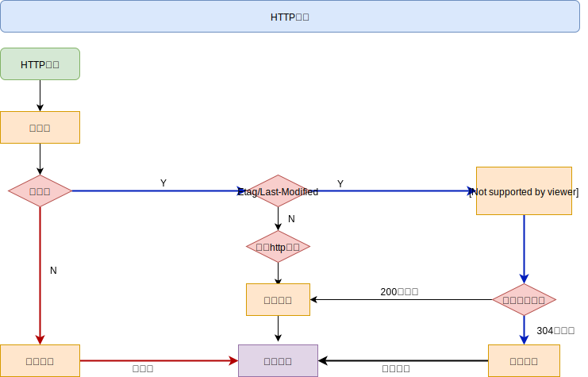

[TOC]

## HTTP缓存

### 为什么要使用HTTP缓存 ？

1.  减少了冗余的数据传输，节省了网费
2.  缓解了服务器的压力， 大大提高了网站的性能
3.  加快了客户端加载网页的速度

### 前端缓存

1.  HTTP缓存
    *   强缓存
        *   Pragma
        *   Cache-Control
        *   Expires
    *   协商缓存
        *   Etag/If-None-Match
        *   Last-Modified/If-Modified-Since
2.  浏览器缓存
    *   本地缓存
        *    Cookie
        *   WebStorage
            *   Session
            *   LocalStorage
        *   WebSql
        *   indexDB
        *   Application Cache
        *   PWA
    *   默认缓存 BFCache

### HTTP缓存

1.  当客户端请求服务器资源是，先抵达浏览器缓存，如果有那么直接提取而不是请求服务器资源
2.  常见的HTTP缓存只能缓存GET请求
3.  HTTP缓存从第二次开始
    *   第一次回传缓存参数
    *   第二次判断这些请求参数
        *   命中直接返回200
        *   否则就把请求参数加入请求头传递服务器
            *   是否命中协商缓存，命中返回304
            *   否则返回新的资源

### 缓存分类

根据是否需要重新向服务器发起请求来可以分为强缓存和协商缓存

|              |                            强缓存                            |                           协商缓存                           |
| :----------: | :----------------------------------------------------------: | :----------------------------------------------------------: |
|   缓存位置   |                          本地浏览器                          |                          本地浏览器                          |
|  http状态码  |                             200                              |                             304                              |
|   谁来决定   |                 Pragma Cache-Control Expires                 |     Etag、If-None-Match Last-Modified/If-Modified-Since      |
| 操作是否有效 | Ctrl+5强制刷新【无效】 F5【无效】 地址栏回车【有效】 页面链接跳转【有效】 新开窗口【有效】前进后退【有效】 | Ctrl+5强制刷新【无效】 F5【有效】 地址栏回车【有效】 页面链接跳转【有效】 新开窗口【有效】前进后退【有效】 |

#### 强缓存

|       header属性        |                             可选                             | 优先级 | 优缺点                                             |
| :---------------------: | :----------------------------------------------------------: | ------ | -------------------------------------------------- |
|    Pragma(HTTP/1.0)     |                   no-cache 不直接使用缓存                    | 高     | HTTP1.1废弃                                        |
| Cache-Control(HTTP/1.1) | no-cache 不直接使用缓存，根据新鲜度；no-store 不使用缓存；max-age 缓存时长；public/private 是否被单个用户使用；must-revalidate 每次访问需要缓存校验 | 中     | 不支持HTTP1.0 资源修改后可能获取不到               |
|   Expires(HTTP/1.0+)    |                           GMT时间                            | 低     | 浏览器服务器时间不一致问题；资源修改后可能获取不到 |

#### 协商缓存

当第一次请求时服务器返回的响应头中没有Cache-Control和Expires或者Cache-Control和Expires过期还或者它的属性设置为no-cache时(即不走强缓存)，那么浏览器第二次请求时就会与服务器进行协商，与服务器端对比判断资源是否进行了修改更新。如果服务器端的资源没有修改，那么就会返回304状态码，告诉浏览器可以使用缓存中的数据，这样就减少了服务器的数据传输压力。如果数据有更新就会返回200状态码，服务器就会返回更新后的资源并且将缓存信息一起返回。

协商缓存的执行流程：当浏览器第一次向服务器发送请求时，会在响应头中返回协商缓存的头属性：ETag和Last-Modified,其中ETag返回的是一个hash值，Last-Modified返回的是GMT格式的最后修改时间。然后浏览器在第二次发送请求的时候，会在请求头中带上与ETag对应的If-Not-Match，其值就是响应头中返回的ETag的值，Last-Modified对应的If-Modified-Since。服务器在接收到这两个参数后会做比较，如果返回的是304状态码，则说明请求的资源没有修改，浏览器可以直接在缓存中取数据，否则，服务器会直接返回数据

|           header属性            |  可选   | 优先 |                            优缺点                            |
| :-----------------------------: | :-----: | :--: | :----------------------------------------------------------: |
|       Etag/If-None-Match        | 校验值  |  高  | 1 使用Hash算法 分布式环境下Etag计算可能不一样 2精确判断资源在1秒内有无被修改 3 计算Etag需要性能消耗 |
| Last-Modified/If-Modified-Since | GMT时间 |  低  | 1 只要资源修改，无论内容是否变化，都会将资源返回客户端 2 某些服务器不能准确获取最后的修改时间 3 不能获取精确到秒级别 |

### 浏览器缓存

|    本地缓存    | 容量 | 特征                                                   |
| :------------: | :--: | ------------------------------------------------------ |
|     cookie     | 4KB  | 1 兼容性好 2 每次与服务器交互 3 设置过期时间           |
| sessionStorage |  5M  | 1 H5特性 2 不会每次与服务器交互 3 会话关闭缓存失效     |
|  localStorage  |  5M  | 1 H5特性 2 不会每次与服务器交互 3 一直存在除非手动删除 |

### 流程说明

#### 图解

#### 流程说明

#### 强缓存

如图红线所示的过程代表强缓存。用户发起了一个http请求后，浏览器发现先本地已有所请求资源的缓存，便开始检查缓存是否过期。有两个http头部字段控制缓存的有效期：Expires和Cache-Control，浏览器是根据以下两步来判定缓存是否过期的：

1.  查看缓存是否有Cache-Control的s-maxage或max-age指令，若有，则使用响应报文生成时间Date + s-maxage/max-age获得过期时间，再与当前时间进行对比（s-maxage适用于多用户使用的公共缓存服务器）
2.  如果没有Cache-Control的s-maxage或max-age指令，则比较Expires中的过期时间与当前时间。Expires是一个绝对时间。

注意，在HTTP/1.1中，当首部字段Cache-Control有指定s-maxage或max-age指令，比起首部字段Expires，会优先处理s-maxage或max-age。

另外下面列几个Cache-Control的常用指令：

*   no-cache：含义是不使用本地缓存，需要使用协商缓存，也就是先与服务器确认缓存是否可用
*   no-store：禁用缓存
*   public：表明其他用户也可使用缓存，适用于公共缓存服务器的情况
*   private：表明只有特定用户才能使用缓存，适用于公共缓存服务器的情况。
    经过上述两步判断后，若缓存未过期，返回状态码为200，则直接从本地读取缓存，这就完成了整个强缓存过程；如果缓存过期，则进入协商缓存或服务器返回新资源过程。

#### 协商缓存

当浏览器发现缓存过期后，缓存并不一定不能使用了，因为服务器端的资源可能仍然没有改变，所以需要与服务器协商，让服务器判断本地缓存是否还能使用。此时浏览器会判断缓存中是否有ETag或Last-Modified字段，如果没有，则发起一个http请求，服务器根据请求返回资源；如果有这两个字段，则在请求头中添加If-None-Match字段（有ETag字段的话添加）、If-Modified-Since字段（有Last-Modified字段的话添加）。注意：如果同时发送If-None-Match 、If-Modified-Since字段，服务器只要比较If-None-Match和ETag的内容是否一致即可；如果内容一致，服务器认为缓存仍然可用，则返回状态码304，浏览器直接读取本地缓存，这就完成了协商缓存的过程，也就是图中的蓝线；如果内容不一致，则视情况返回其他状态码，并返回所请求资源。下面详细解释下这个过程：

1.  ETag和If-None-Match
    二者的值都是服务器为每份资源分配的唯一标识字符串。
    *   浏览器请求资源，服务器会在响应报文头中加入ETag字段。资源更新时，服务器端的ETag值也随之更新；
    *   浏览器再次请求资源时,会在请求报文头中添加If-None-Match字段,它的值就是上次响应报文中的ETag的值；
    *   服务器会比对ETag与If-None-Match的值是否一致，如果不一致，服务器则接受请求，返回更新后的资源；如果一致，表明资源未更新，则返回状态码为304的响应，可继续使用本地缓存，要注意的是，此时响应头会加上ETag字段，即使它没有变化。
2.  Last-Modified和If-Modified-Since
    二者的值都是GMT格式的时间字符串
    *   浏览器第一次向服务器请求资源后，服务器会在响应头中加上Last-Modified字段，表明该资源最后一次的修改时间；
    *   浏览器再次请求该资源时，会在请求报文头中添加If-Modified-Since字段，它的值就是上次服务器响应报文中的Last-Modified的值；
    *   服务器会比对Last-Modified与If-Modified-Since的值是否一致，如果不一致，服务器则接受请求，返回更新后的资源；如果一致，表明资源未更新，则返回状态码为304的响应，可继续使用本地缓存，与ETag不同的是：此时响应头中不会再添加Last-Modified字段。

3.ETag较之Last-Modified的优势

HTTP1.1中ETag的出现主要是为了解决几个Last-Modified比较难解决的问题：

*   一些文件也许会周期性的更改，但是他的内容并不改变(仅仅改变的修改时间)，这个时候我们并不希望客户端认为这个文件被修改了，而重新GET；
*   某些文件修改非常频繁，比如在秒以下的时间内进行修改，(比方说1s内修改了N次)，If-Modified-Since能检查到的粒度是s级的，这种修改无法判断(或者说UNIX记录MTIME只能精确到秒)；
*   某些服务器不能精确的得到文件的最后修改时间

