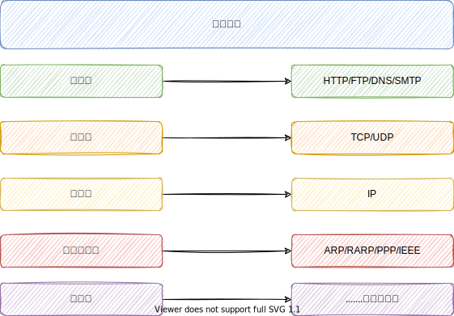
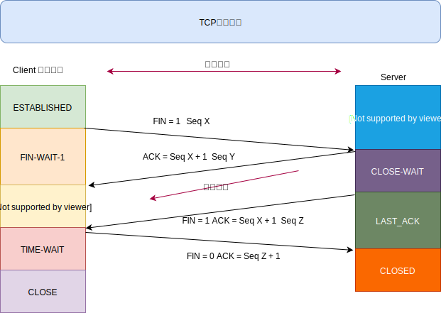

[TOC]

# 计算机网络

>   GodYao

## 问题1：OSI的TCP/IP各层的结构和功能，都有哪些协议？

一般情况下，为了方便理解我们将OSI的七层架构和TCP/IP的四层架构综合，得出五层架构体系

**应用层**

1.  通过应用进程间的交互完成特定的网络应用
2.  每一层协议定义的是应用进程间的通信和交互规则
3.  协议
    *   域名系统DNS【域名和IP地址对应，域名标识唯一的IP地址】
    *   万维网HTTP【超文本传输协议，最初应用于浏览器的HTML解析】
    *   邮件系统SMTP

**传输层**

1.  提供可靠的端到端的差错和流量控制，保证报文的正确传输
2.  传输层的作用是向高层屏蔽下层数据通信的细节，即向用户透明地传送报文
3.  协议
    *   传输控制协议TCP【提供面向连接的、可靠的数据传输服务】
    *   用户数据协议UDP【提供无连接的、尽最大努力的数据传输服务，不保证传输的可靠性】
4.  端口： 映射主机上的一个服务

**网络层**

1.  通过路由选择算法，为报文或分组通过通信子网选择最适当的路径
2.  控制数据链路层与传输层之间的信息转发，建立、维持和终止网络的连接
3.  IP地址，子网通信【通常通过域名解析DNS来得到接受方的IP地址】
    *   点分十进制 0.0.0.0 - 255.255.255.255
    *   网络部分 + 主机
4.  子网掩码 255.255.255.0, 网络部分全为1，主机为0
5.  将多个IP地址与子网掩码做与运算，可得到是否处于同一个子网

**数据链路层**

1.  通过各种控制协议，将有差错的物理信道变为无差错的、能可靠传输数据帧的数据链路
2.  数据链路将网络层的IP数据报封装成**帧**，在节点之间传输
    *   每一帧包含数据和控制信息：标头 + Data，标头固定18字节
    *   发送者，接收者
3.  MAC地址【网卡】，解决网络内部寻址问题
    *   ARP协议根据IP获取MAC地址
    *   在**子网中**采用广播的方式发送带有IP的数据包
    *   收到IP和自身对比后，返回MAC地址给发送方
    *   如果主机不是位于同一个子网中，那么需要网关来转发

**物理层**：通过设备将主机连接，比特流传输

1.  利用传输介质为数据链路层提供物理连接，实现比特流【01】的透明传输
2.  实现相邻计算机节点之间比特流的透明传送，尽可能屏蔽掉具体传输介质和物理设备的差异
3.  设备【双绞线、同轴电缆、光纤】

**拓展**

|  应用程序  |  FTP  | TFTP | TELNET | SMTP | DNS  | HTTP | SSH  | MYSQL | Redis |
| :--------: | :---: | :--: | :----: | :--: | :--: | :--: | :--: | :---: | ----- |
|  熟知端口  | 21,20 |  69  |   23   |  25  |  53  |  80  |  22  | 3306  | 6379  |
| 传输层协议 |  TCP  | UDP  |  TCP   | TCP  | UDP  | TCP  | TCP  |  TCP  | TCP   |

## 问题2：TCP三次握手的流程以及为什么？

**关键词**

1.  SYN = 1 特殊报文段，握手信号【**表示建立连接的数据报不能携带数据**】
2.  Seq 随机序列号
3.  ACK 确认码【确认应答机制】
4.  SYN_Send SYN_Recv established

**流程**

1.  客户端发送包含连SYN = 1 和 Seq X随机序列号【放置在SYN报文段的序号中】的IP数据报，处于SYN_Send状态
2.  服务端接收到IP数据报，取出SYN和序列号
    *   给连接分配缓存和变量【SYN洪水攻击】
    *   将SYN 置为1
    *   将接收到的Seq X加1作为报文段首部ACK确认码
    *   生成服务端的随机序列好 Seq Y，放置在报文段首部的序号字段中，标志位ACK=1
    *   发送 SYN分组【IP数据报】
    *   处于SYN_Recv状态
3.  客户端接收到SYN和ACK确认码同时验证，验证成功后【连接建立】
    *   给连接分配缓存和变量
    *   SYN = 0
    *   SYN报文段的首部确认字段置为Seq Y + 1
    *   发送SYN分组【IP数据报】【**此时已经可以携带数据**】【对服务器的允许连接确认】
    *   处于Established状态
4.  服务端收到SYN分组，连接建立成功

**为什么三次握手？**

**TCP 建立连接时，通过三次握手能防止历史连接的建立，能减少双方不必要的资源开销，能帮助双方同步初始化序列号。序列号能够保证数据包不重复、不丢弃和按序传输**

第一种理解

1.  TCP是可靠的传输协议，TCP建立连接三次传输三次数据分组，**目的就是为了保证对方的发送接收正常**

2.  第一次：服务端接收客户端的数据并且做了回应

    *   客户端什么都不能确定

    *   服务端确定自己接收、发送正常

3.  第二次：客户端收到服务端的确认信息

    *   客户端确定自己发送，接收正常，同时知道服务端的接收、发送正常
    *   服务端确定自己接收、发送正常

4.  第三次：服务端收到客户端确认信息

    *   客户端确定自己发送，接收正常，同时知道服务端的接收、发送正常

    *   服务端确定自己发送、接收正常，同时客户端接收、发送正常

第二种理解

1.  在第二次握手其实连接已经建立
2.  **第三次握手：主要防止已经失效的连接请求报文突然又传送到了服务器，从而产生错误**

**作用**

1.  指定初始序列化，为后面传输做准备
2.  确认双方的交付能力，建立可靠的连接
3.  指定自己的初始序列号，为后面的传输做准备

**传SYN为什么还要传ACK？**

1.  SYN是确保发送方到接收方没有问题
2.  ACK是验证接收方到发送方没有问题

## 问题3：TCP四次挥手的流程以及为什么？

**关键词**

1.  FIN 请求断开连接特殊报文
2.  Seq随机序列号
3.  各种状态

**流程**

1.  第一次挥手：客户端主动发起断开连接请求，发送FIN = 1 和 Seq X 的数据报，处于FIN-WAIT-1状态
2.  第二次挥手：服务端收到数据报，发送ACK = Seq X + 1的确认码和 Seq Y随机序列号，处于CLOSE_WAIT状态
    *   TCP通知高层应用释放客户端到服务端的连接，处于半关闭状态
    *   服务端可以向客户端发送数据
    *   客户端接受到确认请求，进入FIN-WAIT-2状态
3.  第三次挥手：服务端发送FIN = 1 ACK = Seq X + 1 以及新的 Seq Z，发起确认断开连接，处于LAST-ACK
4.  第四次挥手
    *   客户端发送 ACK = Seq Z + 1 ，处于TIME-WAIT状态**【经过2*MSL（最长报文段寿命）的时间后才释放】**
    *   服务端接收到，处于CLOSE状态

**半关闭**

TCP服务器通知高层的应用进程，客户端向服务器的方向就释放了，这时候处于半关闭状态，即客户端已经没有数据要发送了，但是服务器若发送数据，客户端依然要接受

**TIME-WAIT**

1.  **确保服务器收到ACK，假定客户端最后一次ACK失效，TIME-WAIT的状态就是客户端重传ACK的时间**
2.  如果没有TIME-WAIT那么同IP端口再次连接，就可能得到脏数据

## 问题4:   TCP如何保证可靠传输？

1.  应用数据被分割成TCP认为最适合发送的数据块
2.  TCP给发送的每一个包进行编号，接收方会进行排序传递到应用层
3.  **校验和**，TCP将保持它首部和数据的校验和
4.  TCP接收短丢弃重复的数据
5.  **流量控制**
    *   采用滑动窗口进行流量控制
    *   每一端都有固定大小的缓冲空间,只允许接收缓冲区接纳的数据,提示对方降低发送效率，减少丢包
6.  **拥塞控制**，当网络拥塞时，减少数据发送
7.  **ARQ协议**，等待已经发送的分组确认再发送下一个
8.  **超时重传**，发送一个段，启动定时器，如果对端没有及时收到，将会重传

## 问题5：ARQ协议？

1.  概念
    *   自动重传请求
    *   确认和超时机制，实现可靠的传输
2.  停止等待ARQ协议
    *   基本流程：A发完一个分组，就等待B回复确认ACK
    *   特点
        *   简单
        *   信道利用率低，等待时间长
    *   超时重传
        *   A超过规定时间【计时器】没有收到ACK那么就会重新发送分组
        *   如果收到重复的分组就会丢弃一个，然后B发送ACK确认
    *   确认丢失
        *   ACK丢失，超时过后，A就会重发分组
        *   B收到重复的分组后，丢弃重复的分组，然后发送ACK确认
    *   确认迟到
        *   B的ACK发送迟到，超时过后，A就会重发分组
        *   B收到两次分组，A收到两次ACK
        *   B丢弃重复的分组，A丢弃重复的ACK
3.  连续ARQ协议
    *   发送方维持一个滑动窗口，位于窗口内的分组都可以发送，接收方采取累计确认的形式，对最后的一个分组发送确认ACK
    *   信道利用率高，但是不能反馈已经接收到的所有分组的信息

## 问题6：滑动窗口和流量控制？

为什么需要流量控制？

1.  发送和接收方的速率不平衡
2.  可能导致丢包的现象
3.  控制发送方的速率，保障接受方来得及接收

如何控制？

1.  TCP采用滑动窗口实现流量控制
3.  接受方在确认报文中的窗口字段中标注自己缓冲区的窗口大小win
3.  发送方收到后就会调整自己的发送速率，发送方也有自己的发送窗口，当win = 0，停止发送

停止了何时再发送？

1.  发送方会在win = 0 后，开启定时器，去探测接受方的win大小

## 问题7：拥塞控制？

1.  概念
    *   流量控制所要做到的就是抑制发送端发送数据的速率，以便使接收端来得及接收
    *   拥塞控制就是为了防止过多的数据注入到网络中，这样就可以使网络中的路由器或链路不致过载
2.  TCP发送方维持一个**拥塞窗口的状态变量**，取决于网络的拥塞程度，动态变化
3.  四种算法来探测网络的拥塞情况
    *   慢开始：发送方先小窗口进行探测，cwnd初始值为1，然后cwnd进行加倍，**指数增长**

    *   拥塞避免：让拥塞窗口cwnd缓慢增大，即每经过一个往返时间RTT就把发送方的cwnd加1，线性增长

    *   最终策略

        *   先慢开始算法，指数增长，到达阀值【就是发送的数据包增长到这个值就不在指数增长了】
        *   然后拥塞避免算法，线性增长
        *   不能一直增长，超时后，阀值=瓶颈最大值 / 2【增长有一个瓶颈最大值】

    *   丢包怎么办？采用冗余的ACK实现

        *   快重传与快恢复——快速恢复丢失的数据包
            *   M1 M2 M3 M4
            *   M3丢失
            *   这个时候就会重复确认M2，告诉M3没有收到需要马上重传
            *   快速重传M3
            *   阀值 = MAX / 2 ，并且将N = 阀值，N一个一个增长
*   没有这个就会重传暂停，有了之后就会收到确认立即重发丢失的数据包

## 问题8:  TCP和UDP区别？

1.  区别
    *   TCP时面向连接的，需要经历三次握手四次挥手，UDP是无连接的
    *   TCP是一对一的服务，UDP可以一对一，一对多，多对多服务
    *   TCP是可靠的传输，UDP是尽最大努力交付
    *   TCP有拥塞控制、流量控制
2.  应用场景
    *   TCP，FTP/HTTP/HTTPS
    *   UDP，DNS、视频、语音、广播通信

## 问题9：TCP"粘包": 如何处理网络报文的消息边界？

**原因：TCP是基于字节流的，TCP协议本身并没有做消息边界功能。TCP是解决路由、传输、可靠性功能。**

具体原因如下说明

1. TCP协议层面

    * **TCP是基于字节流的协议，并没有消息边界的功能, 没有粘包的说法**
    * **消息边界的处理应该由应用层协议设计者决定**

2. 发送端层面

    * 延迟数据发送(直到达到最大报文长度或者收到ACK)，提高带宽利用率(发生粘包)
    * 对数据MSS大小的TCP分段 (MSS最大报文长度 = TCP报文 - TCP首部)，写入缓冲区(发生拆包)

3. 接受端层面

    * 无法知道消息边界
    * 缓冲区堆积数据

4. 网络层面

    MTU往往小于在应用处理的消息数据，IP分片

**解决 Head + playload**

**HTTP协议如何解决？**

1. Content-Length HTTP 协议的消息边界基于长度实现

~~~
<calculated when request is sent>
~~~

2. Transfer-encoding: chunked 基于终结符的策略

~~~
长度，内容，长度，内容，........0，空行
~~~