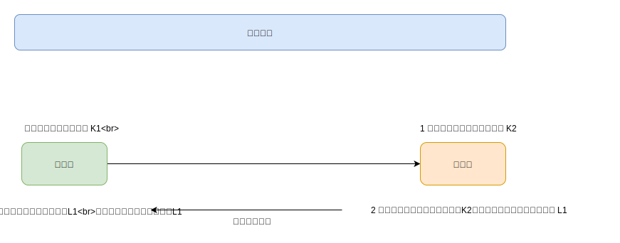

[TOC]

# HTTP

## 问题0: HTTP协议？

1.  超文本传输协议
2.  以请求-响应机制，定义客户端和服务端的数据[图片、文本、视频、音频]交换
    *   请求方法
    *   数据格式
    *   状态等

## 问题1: HTTP报文格式

3.  请求报文
    *   请求行
    *   请求首部
    *   请求体
4.  响应报文
    *   响应行，响应状态码、响应短语
    *   响应首部
    *   响应体

## 问题2: HTTP状态码？

1.  1xx：指示信息–表示请求已接收，继续处理
2.  2xx：成功–表示请求已被成功接收、理解、接受
3.  3xx：重定向–要完成请求必须进行更进一步的操作
4.  4xx：客户端错误–请求有语法错误或请求无法实现
5.  5xx：服务器端错误–服务器未能实现合法的请求
6.  平时遇到比较常见的状态码有:200, 204, 301, 302, 304, 400, 401, 403, 404, 422, 500

问：301和302有什么区别？

1.  301 永久重定向，比如域名跳转

    301 Moved Permanently 被请求的资源已永久移动到新位置，并且将来任何对此资源的引用都应该使用本响应返回的若干个URI之一。**如果可能，拥有链接编辑功能的客户端【浏览器】应当自动把请求的地址修改为从服务器反馈回来的地址。除非额外指定，否则这个响应也是可缓存的**

2.  302 临时重定向，比如从未登录的页面跳到登录页面

    302 Found 请求的资源现在临时从不同的URI响应请求.由于这样的重定向是临时的，客户端应当继续向原有地址发送以后的请求。只有在Cache-Control或Expires中进行了指定的情况下，这个响应才是可缓存的

## 问题3: HTTP请求方法？

1.  GET：   请求资源
2.  POST： 传输数据
3.  PUT：   上传文件
4.  HEAD：获取报文首部
5.  DELETE：删除文件
6.  OPTIONS：查询当前请求允许的方法

问：GET POST区别？

1.  意义上看，GET获取资源，POST倾向于Push发送
2.  GET请求的URL有长度限制, 发送数据在URL后面
3.  POST发送数据在请求体中
4.  GET请求，一个TCP包
5.  POST请求两个，先发送header 100 continue ，然后发送data  200 OK
6.  GET请求会被cache，POST不会
7.  GET请求浏览器可以回退前进，POST会重新提交表单

## 问题4: HTTP长连接？短连接？

1.  HTTP1.0，默认使用短连接，每发起一次HTTP请求响应后就断开连接
2.  HTTP1.1，默认使用长连接，一次TCP连接中，可以发起多次HTTP请求，不会立马断开TCP，有一个保持时间

~~~
Connection:keep-alive
~~~

3.  HTTP的长短连接实际上是TCP的长短连接

## 问题5: HTTP无状态协议？

1.  HTTP是一种无状态的协议，不会保存上一次的请求状态
    *   客户端A第一次发送请求，得到服务器响应
    *   同一个客户端A第二次请求，服务器无法识别是刚才的客户端A
    *   意思就是堆用户的操作没有记忆能力
2.  Cookie机制
    *   有时效
    *   浏览器关闭消失
3.  Session方案
    *   SessionID、过期失效
    *   Cookie被禁用，那么可以讲SessionID附加在URL后面

## 问题6: Cookie、Session的作用？

1.  Cookie和Session都是用来追踪浏览器用户的身份
2.  Cookie一般用来保存用户的信息、存储在浏览器，在Cookie中存Token以此来查找用户
3.  Session通过服务器记录用户的状态、存储在服务器

## 问题7: HTTP1.0和HTTP1.1的区别？

1.  HTTP1.0使用短连接、HTTP1.1使用长连接
2.  HTTP1.1新增了错误响应码
3.  HTTP1.1引入了更多的缓存策略
4.  HTTP1.1带宽优化及网络连接的使用，range头域，允许请求资源的某部分

## 问题8: URI和URL的区别？

1.  URI  统一资源标识符，用来唯一标示一个资源 [图片、文档、视频、音频]
    *   
2.  URL 统一资源定位符，一种具体的URI，可以标示，也可以定位到具体的资源
    *   协议
    *   主机
    *   主机资源的具体地址

## 问题9: HTTP和HTTPS的区别？

1.  HTTP默认使用80端口、HTTPS默认使用443端口
2.  安全性和资源消耗
    *   HTTP协议运行在TCP之上，所有的传输是明文的
    *   HTTPS是运行在SSL/TLS之上的HTTP协议，SSL/TLS 运行在TCP之上
        *   采用对称加密。加解密只有一个密钥
        *   需要证书、HTTPS资源消耗比HTTP高

## 问题10: HTTPS？

1.  HTTP缺点
    *   **明文传输**, 不安全
    *   不验证身份
    *   无法验证报文的完整性
3.  对称加密
    *   加密解密同一套密钥
    *   运算速度快
    *   过程
        *   服务端先将密钥发送给客户端
        *   发送数据的时候，将数据使用密钥加密
        *   客户端收到数据，使用密钥解密
    *   缺点：密钥采用的是明文传输，密钥容易被劫获
4.  非对称加密
    *   使用不同的密钥加解密
    *   发送方使用公钥加密，接受方使用自己私钥解密
    *   更加的安全
    *   加密的速度慢
5.  HTTPS采用混合加密形式
    *   采用非对称加密传输对称加密使用的密钥，保障密钥的安全
    *   采用对称加密形式进行通信，保障效率

5.  非对称加密也不是完全安全的
    *   中间人截获了k2, 然后发送自己的公钥P1到客户端
    *   然后又截获客户端发送的加密后的对称加密的密文，采用自己的私钥P2解密
    *   获取到了双方对称加密的密钥

问题？客户端不知道自己收到的公钥是不是服务端的，数字证书用来解决这个问题

1.  先选择一个认可的证书认证中心
2.  服务器将 [服务器个人信息 + 服务器公钥] 进行Hash形成**信息摘要**
3.  服务器使用CA提供的私钥将信息摘要加密形成数字签名 【服务器申请的私钥和公钥】
4.  将[服务器个人信息 + 服务器公钥] 和 数字签名合并形成**数字证书**
5.  客户端拿到数字证书使用 CA提供的公钥对数字签名进行解密得到Hash值 H1【客户端内置很多公钥】
6.  然后将数字证书中的[服务器个人信息 + 服务器公钥] Hash H2， 对比H1和H2，一致则是服务器发送的
7.  然后就可以进行非对称加密传输对称加密使用的密钥了

## 问题12: HTTP1.1新特性

1.  持久连接

    一次TCP连接，可以发送多次HTTP请求

~~~
Keep-Alive: Connection 
~~~

2.  管线化

    可以不必等待响应的返回，同时发出多个请求

3.  断点续传 Range

4.  分块传输

5.   E-tag，If-Unmodified-Since, If-Match, If-None-Match 等缓存控制标头来控制缓存失效

6.   缺点：同一域名同一时间的请求有限制，超过就会阻塞

​    

## 问题13: HTTP优化

1.  持久连接
2.  HTTP缓存
3.  压缩功能

## 问题14: HTTP2？

1.  采用全二进制协议，所有的数据都是二进制的
2.  管线化，多路复用
    *   同时可以发出多个HTTP请求
    *   不再以文本的方式传输，**二进制分帧层**，对头部进行了压缩，支持流的控制

3.  服务器可以推送

## 问题15: 浏览器输入URL到服务器返回的流程？

**过程**

1.  DNS解析
2.  TCP链接
3.  发送HTTP请求
4.  服务器处理请求并且返回HTTP报文
5.  浏览器解析数据渲染页面
6.  链接结束

**DNS解析**

1.  DNS解析的目的就是为了通过域名在DNS服务器上找到IP地址
2.  DNS递归查询 本地DNS服务器、根域名服务器、顶级域名服务器，找到后缓存在本地DNS
3.  DNS有以下几种缓存
    -   浏览器缓存
    -   系统缓存
    -   路由器缓存
    -   IPS缓存
    -   根域名服务器缓存
    -   顶级域名服务器缓存
    -   主域名服务器缓存
4.  DNS返回的IP不一定是一样的，服务可能部署在不同的服务器上，所以DNS也有负载均衡

**连接**

1.  TCP
2.  HTTP/HTTPS
    -   HTTPS在传输数据之前需要客户端与服务器进行一个握手(TLS/SSL握手)
    -   握手过程中将确立双方加密传输数据的密码信息

## 问题16: 跨域？

## 问题17:  Json Web Token?

## 问题18：HTTPS通信步骤？

1.  TCP的三次握手，客户端通过发送Client Hello报文开始SSL通信，报文中包含客户端支持的SSL的指定版本、加密组件列表（所使用的加密算法及密钥长度等）
2.  服务器可进行SSL通信时，会以Server Hello报文作为应答，和客户端一样，在报文中包含SSL版本以及加密组件，服务器的加密组件内容是从接收到的客户端加密组件内筛选出来的
3.  之后服务器发送Certificate报文，报文中包含公开密钥证书
4.  最后服务器发送Server Hello Done 报文通知客户端，最初阶段的SSL握手协商部分结束
5.  客户端验证证书有效性
6.  SSL第一次握手结束之后，客户端以Client Key Exchange报文作为回应，报文中包含通信加密中使用的一种被称为Pre-master secret的随机密码串，该报文已用步骤3中的公开密钥进行加密
7.  接着客户端继续发送Change Cipher Spec报文，该报文会提示服务器，在此报文之后的通信会采用Pre-master secret密钥加密
8.  客户端发送Finished报文，该报文包含连接至今全部报文的整体校验值，这次握手协商是否能够成功，要以服务器是否能够正确解密该报文作为判定标准
9.  服务器同样发送Change Cipher Spec报文
10.  服务器同样发送Finshed报文
11.  服务器和客户端的Finished报文交换完毕之后，SSL连接就算建立完成，当然，通信会受到SSL的保护，从此处开始进行应用层协议的通信，即发送HTTP请求