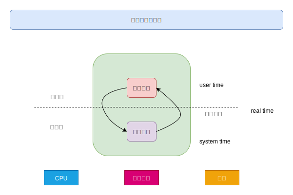

[TOC]

#### 问题1: 企业如何进行Golang调试？【CPU性能和内存分析方法】

##### 场景1: 程序的运行时间和CPU利用率

~~~bash
apple-liyao@MacBook-Air test % /usr/bin/time go run test.go 
        1.67 real         0.61 user         0.61 sys
~~~

1.  real 程序开始到结束的时间
2.  user 程序在用户态度过的时间
3.  sys 程序在内核态度过时间
4.  一般情况下：real >= user + sys

~~~bash
apple-liyao@MacBook-Air test % time go run test.go 
go run test.go  0.64s user 0.71s system 72% cpu 1.867 total
~~~

##### 场景2: 内存的使用情况

top

~~~bash
top -p $(pidof 进程名)  # Linux
top # 查看
q   # 退出
~~~

GODEBUG gctrace

~~~go
GODEBUG='gctrace=1' ./test
....
gc 5 @0.065s 9%: 0.080+4.4+2.2 ms clock, 0.32+0/1.7/0.30+9.0 ms cpu, 15->15->15 MB, 16 MB goal, 4 P
....
~~~

1.  gc 5 第几次GC
2.  @0.065 程序执行时间
3.  9% GC占用时间比例
4.  0.080+4.4+2.2 ms clock 【STW时间 + 并发标记时间 + STW标记时间】
5.  0.32+0/1.7/0.30+9.0 ms cpu 【GC占CPU时间】
6.  15->15->15 MB 【GC开始前中 堆内存大小，当前堆活跃大小】
7.  16 MB goal 【全局堆内存大小】
8.  4 P 【执行器Processor个数】

runtime

在代码中定义runtime.MemStats对象来查看

~~~go
var runtimeMem runtime.MemStats
runtime.ReadMemStats(&runtimeMem)
log.Println(runtimeMem.Alloc)       //服务分配的堆内存字节数
log.Println(runtimeMem.HeapIdle)    //申请但是未分配的堆内存或者回收了的堆内存（空闲）字节数
log.Println(runtimeMem.HeapReleased)//返回给OS的堆内存，类似C/C++中的free。
~~~

pprof

~~~go
// http://127.0.0.1:8080/debug/pprof/heap?debug=1
import (
	"net/http"
	_ "net/http/pprof"
)
func main() {
    log.Fatal(http.ListenAndServe(":8080", nil))
}
~~~

##### 场景3: CPU性能分析和利用率

注意事项

1.  可重复的、稳定的环境
2.  不要在共享的硬件上进行性能分析
3.  注意省电模式和过热保护
4.  不要使用虚拟机和共享云主机

建议

1.  关闭电源和过热管理
2.  不要升级保证环境一致性
3.  购买专业的硬件环境

CPU性能分析

1.  web界面查看

~~~go
// http://127.0.0.1:8080/debug/pprof
import (
	"net/http"
	_ "net/http/pprof"
)
func main() {
    // 然后点击页面中的profile，下载生成
    log.Fatal(http.ListenAndServe(":8080", nil))
}
~~~

